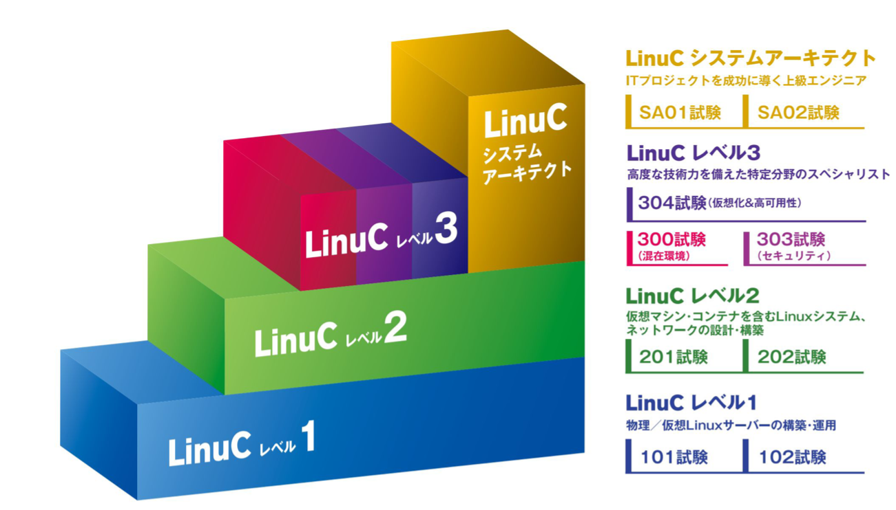

# まえがき {.unlisted .unnumbered}
特定非営利活動法人エルピーアイジャパンが、「Linux標準教科書」の初版を公開したのは2008年のことでした。Linux技術者教育に利用していただくことを目的として開発し、今回で3回目の改訂となりました。

今回の改訂では、標準教科書シリーズを独学自習で使っている方が多いことから、仮想マシンを使って実習環境を構築する手順に変更しました。また、これまでの内容を全面的に見直し、実習中心の「動かして学ぶ」スタイルに書き改めました。

公開にあたっては、本教科書に添付されたライセンス（クリエイティブ・コモンズ・ライセンス）の下に公開されています。

本教科書は、最新の技術動向に対応するため、随時アップデートを行っていきます。

本教科書の最新情報は以下のWebページをご参照ください。

```
https://linuc.org/textbooks/linux/
```

## 本教科書の目的 {.unlisted .unnumbered}
教科書の目的は、基本的なLinuxのコマンド操作と簡単なシステム管理に必要な知識を、実習を通して学習することにあります。

細々とした解説を行うことで冗長になることを避けるために、解説は必要最低限のものとしています。そのため、この教科書の位置づけはあくまで「Linuxを初めて触る人の助けになる」というものになっており、Linux技術者として修得して欲しい技術すべてをカバーできていません。この教科書とあわせて『Linuxサーバー構築教科書』および『Linuxシステム管理標準教科書』も学習してみてください。この3部作を一通り学習すれば、市販のLinux関連書籍などを手に取っても、何が書いてあるのか分かるスキルレベルに到達できるでしょう。本教科書の内容を学習すれば、他の2冊の教科書の実習もスムーズに進められるようになります。まずはLinuxの操作と管理の基礎を習得します。

## 想定している実習環境 {.unlisted .unnumbered}
本教科書は一人で独学自習できることを想定しています。実習環境として、以下の環境を構築しています。

### 仮想マシンを利用 {.unlisted .unnumbered}
仮想マシンを利用して学習環境を構築します。仮想マシンを利用すると、WindowsやLinux、macOS上の仮想マシンにLinuxをインストールし、動作させることができます。

仮想マシン環境を実現するソフトウェアとして、以下のようなものがあげられます。

- VirtualBox（Windows、Linux、macOS）
- VMware Workstation（Windows）
- VMware Fusion（macOS）
- Parallels Desktop（macOS）
- UTM（macOS）
- Linux KVM（Linux）

本教科書では、VirtualBoxをWindows上で実行して解説を進めます。

### OS {.unlisted .unnumbered}
本教科書では、LinuxディストリビューションとしてAlmaLinuxのバージョン9.4を利用します。

実習例ではIntel/AMD x86_64アーキテクチャに対応したバージョンを利用していますが、ARM版などその他のアーキテクチャに対応したバージョンでも実習を行うことができます。

### ネットワーク {.unlisted .unnumbered}
実習を行うネットワークはインターネットに接続できることを前提としています。

インターネットに接続できない場合には、OSのインストール時に実習で必要となるソフトウェアをあらかじめインストールすることで実習を進めることができます。OSインストール手順解説の指示に従って事前にソフトウェアをインストールしてください。

## 全体の流れ {.unlisted .unnumbered}
本教科書では、以下の通りに実習を進めます。

### 1章 Linuxを学ぶ {.unlisted .unnumbered}
Linuxを学ぶとはどういうことなのか、本教科書で学習する内容の全体像を解説します。

### 2章 VirtualBoxのインストールと仮想マシンの作成 {.unlisted .unnumbered}
仮想マシンについての解説と、VirtualBoxのインストール、仮想マシンの作成を行います。

### 3章 Linuxのインストールと設定 {.unlisted .unnumbered}
仮想マシンにLinuxをインストールします。

### 4章 Linuxを操作してみよう {.unlisted .unnumbered}
Linuxをコマンドで操作することについてのイメージを掴むため、Webサーバーを動かしてみます。また、以後の実習を進めやすくするため、SSHによるリモートログインの方法も解説します。

### 5章 基本的なコマンド {.unlisted .unnumbered}
Linuxを操作するための基本的なコマンドであるファイルやディレクトリの操作、その他基本コマンドを解説します。

### 6章 標準入出力とフィルタコマンド {.unlisted .unnumbered}
Linuxのコマンドに備わっている、コマンド間のデータを連携する標準入出力とと、標準入出力を活用しるフィルタコマンドについて解説します。

### 7章 viエディタ {.unlisted .unnumbered}
Linuxの基本的なエディタであるviエディタの操作方法について解説します。

### 8章 ユーザーとグループの管理 {.unlisted .unnumbered}
Linuxのシステム制御の基本単位であるユーザーとグループの管理について解説します。

### 9章 ファイルやディレクトリのアクセス制御 {.unlisted .unnumbered}
ファイルやディレクトリに対するアクセス制御について解説します。

### 10章 ネットワークの設定と管理 {.unlisted .unnumbered}
Linuxのネットワークの設定と管理について解説します。

### 11章 プロセス管理 {.unlisted .unnumbered}
Linux上で動作するプログラムはプロセスとして扱われます。プロセスの管理について解説します。

## 執筆者紹介
本教科書は、オープンなプロジェクト形式で開発を行っています。企画段階から意見交換を行い、事前の技術的な調査、執筆、レビューなどをプロジェクトのメンバーで分担して行っています。

### 宮原 徹（バージョン1企画・バージョン4執筆担当） {.unlisted .unnumbered}
本教科書は、2008年にバージョン1を企画、公開しました。それから16年が経ち、現在では不要となっている技術も多くあるため、それらの項目を省きつつ、最新のLinuc レベル1の出題範囲を考慮して思い切って仮想マシンを使った実習環境構築から行う手順に変更しました。その他、実務で必要となる最低限の知識を意識して、短時間で実習を進められるように改訂しています。
Linuxの基本的なコマンドの学習は、山や森全体から見れば1本1本の木のようで、なかなか全体像が掴めないかと思います。最初はまず実習を1つずつ確実に実行して、実行例と同じ結果が返ってくることを確認してみてください。一通り最後まで終わらせたら、再度それぞれの実行例の意味を考えながら、必要に応じて本教科書以外の書籍の解説も参照しながら実行してみてください。3回目には、それぞれのコマンドの意味がわかってくるかと思います。1回では覚えられない前提で、3回は繰り返してみてもらえればと思います。

### バージョン4の開発にご協力をいただいた方々（50音順） {.unlisted .unnumbered}

また、これまでバージョン1からバージョン3まで、沢山の執筆者、レビュアー、そして利用者の皆様からフィードバックをいただきました。厚く御礼申し上げます。


## 著作権 {.unlisted .unnumbered}
本教科書の著作権は特定非営利活動法人エルピーアイジャパンに帰属します。

Copyright©️ LPI-Japan. All Rights Reserved.

## 使用に関する権利 {.unlisted .unnumbered}
本教科書は、クリエイティブ・コモンズ・ライセンスの「表示 - 非営利 - 改変禁止 4.0 国際 (CC BY-NC-ND 4.0) 」によってライセンスされています。

{width=200px}


### 表示 {.unlisted .unnumbered}
本教科書は、特定非営利活動法人エルピーアイジャパンに著作権が帰属するものであることを表示してください。

### 非営利 {.unlisted .unnumbered}
本教科書は、非営利目的で教材として自由に利用することができます。

商業上の利得や金銭的報酬を主な目的とした営利目的での利用は、特定非営利活動法人エルピーアイジャパンによる許諾が必要です。ただし、本教科書を利用した教育において、本教科書自体の対価を請求しない場合は、営利目的の教育であっても基本的に使用できます。
その場合も含め、LPI-Japan 事務局までお気軽にお問い合わせください。

＊営利目的の利用とは以下のとおり規定しております。
営利企業または非営利団体において、商業上の利得や金銭的報酬を目的に本教科書の印刷実費以上の対価を受講生に請求して本教科書の複製を用いた研修や講義を行うこと。

### 改変禁止 {.unlisted .unnumbered}
本教科書は、改変せず使用してください。本教科書に対する改変は、特定非営利活動法人エルピーアイジャパンまたは特定非営利活動法人エルピーアイジャパンが認める団体により行われています。

## フィードバック {.unlisted .unnumbered}
フィードバックは誰でも参加できる Slack で受け付けていますので、積極的にご参加ください。Slack参加の詳細は以下の本教科書のWebページを参照してください。

```
https://linuc.org/textbooks/linux/
```

{width=25%}

## 本教科書の使用に関するお問合せ先 {.unlisted .unnumbered}
特定非営利活動法人エルピーアイジャパン（LPI-Japan）事務局
〒100-0011 東京都千代田区内幸町2-1-1 飯野ビルディング9階
TEL：03-6205-7025
E-Mail：info@lpi.or.jp

\pagebreak
## Linux技術者認定「LinuC（リナック）」のご紹介 {.unlisted .unnumbered}
Linux技術者認定「LinuC（リナック）」とは、クラウド／DX時代のITエンジニアに求められるシステム構築から運用管理に必要なスキルを証明できる技術者認定です。アーキテクチャ設計からシステム構築、運用管理までの技術領域を広くカバーしており、４つのレベルの認定取得を通じて一歩ずつ確実に求められるスキルを習得し、それを証明することができます。

LinuCの出題範囲策定や試験開発は、実際に現場で活躍しているハイレベルなITエンジニアが参加するコミュニティによって行われています。そのため、グローバルで業界標準として利用されている技術領域をカバーし、システム開発や運用管理の現場で本当に必要とされる知識や実践的なスキルを問う内容になっています。その結果として従来型のLinux領域にとどまった技術認定とは異なり、国内・海外を問わず活躍を目指すITエンジニアにとっても十分役立つ技術者認定となりました。

{width=50%}

### LinuCレベル１ {.unlisted .unnumbered}
コンピュータシステムを理解し、仮想環境を含むLinuxシステムの基本操作とシステム管理が行える即戦力エンジニアの証明（ITSSレベル1）

### LinuCレベル２ {.unlisted .unnumbered}
仮想環境を含むLinuxのシステム設計・ネットワーク構築において、アーキテクチャに基づいた設計・導入・保守・問題解決ができるエンジニアの証明（ITSSレベル2）

### LinuCレベル３ {.unlisted .unnumbered}
異種混在環境の運用スキル、Linuxベースのセキュアなシステム設計・構築スキル、大規模な仮想化システムや高可用性システムの構築スキルといったスペシャリストの証明（ITSSレベル3）

### LinuCシステムアーキテクト {.unlisted .unnumbered}
オンプレ／クラウド、物理／仮想化を含むシステムのライフサイクル全体を俯瞰して最適なアーキテクチャを設計・構築ができる上級エンジニアの証明（ITSSレベル4相当のスキルレベル）

LinuCの詳細については、以下のWebサイトを参照してください。

```
https://linuc.org/about/01.html
```

{width=25%}

### LinuCの認定取得に向けた学習方法

LinuCの特徴の1つに学習教材の豊富さが挙げられます。「認定教材」と呼ばれるLinuCの出題範囲を網羅した教材だけでなく、例えば実際のコマンド操作の様子などを確認することができる動画コンテンツなどは多くの方に利用されています。
特に書籍からだけでは理解が難しいポイント、動く様子を見る方が理解しやすいポイントなどをピックアップして解説しているので、Linux標準教科書で学習している方々にも参考になる内容となっています。誰でも無料で視聴することができますので、ぜひ一度ご覧ください。

```
https://linuc.org/measures/movie/
```

\pagebreak
