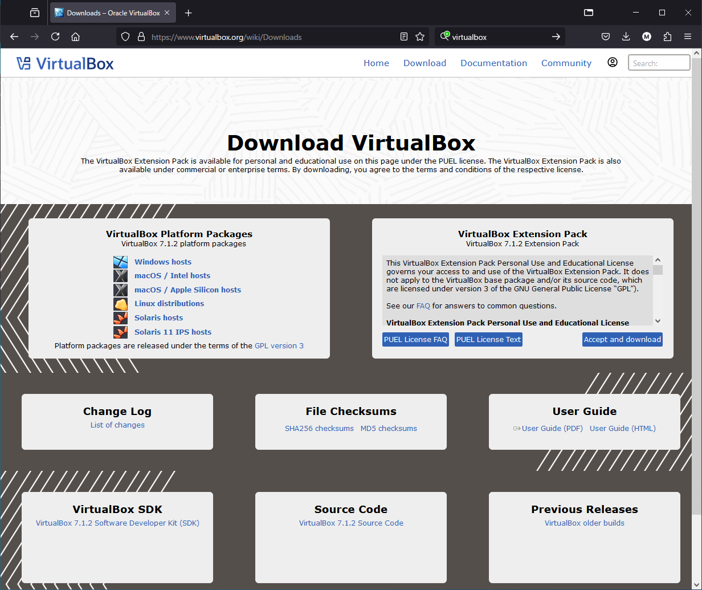
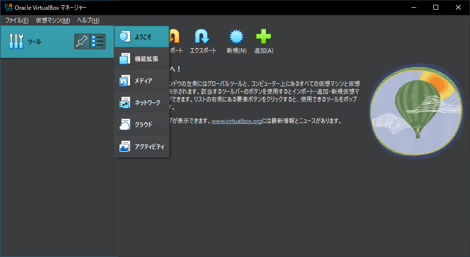
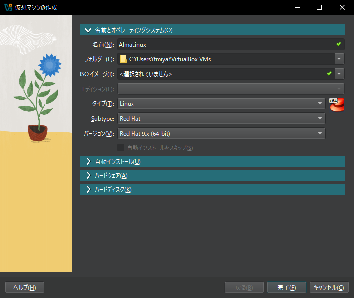
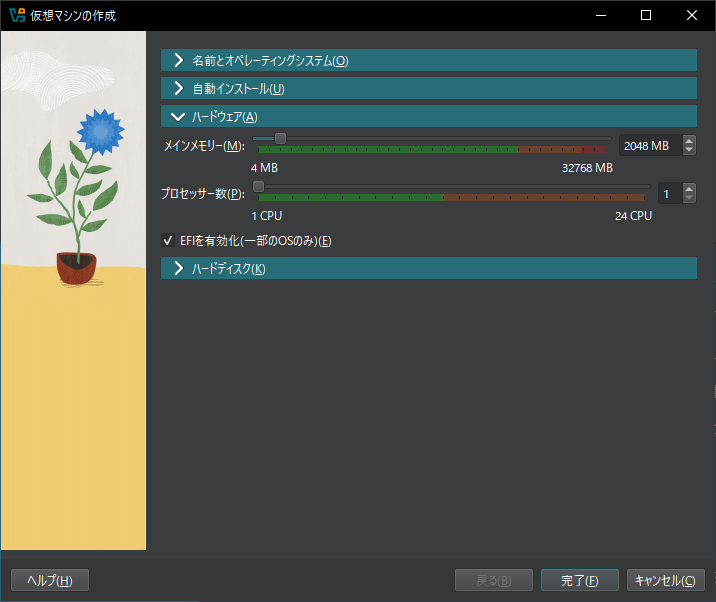
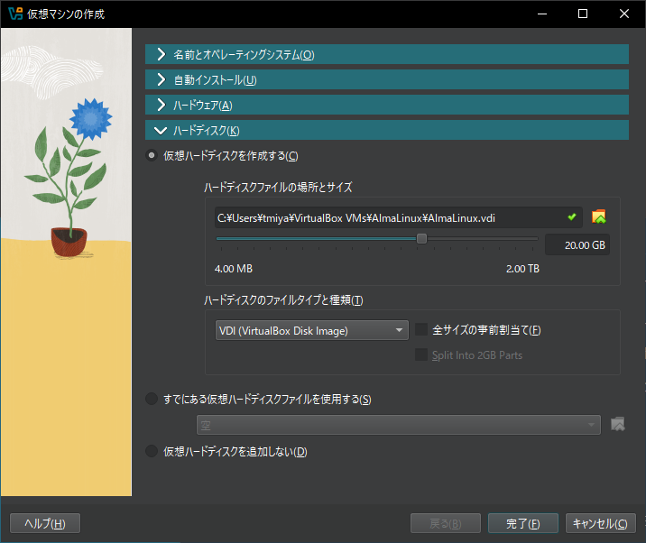
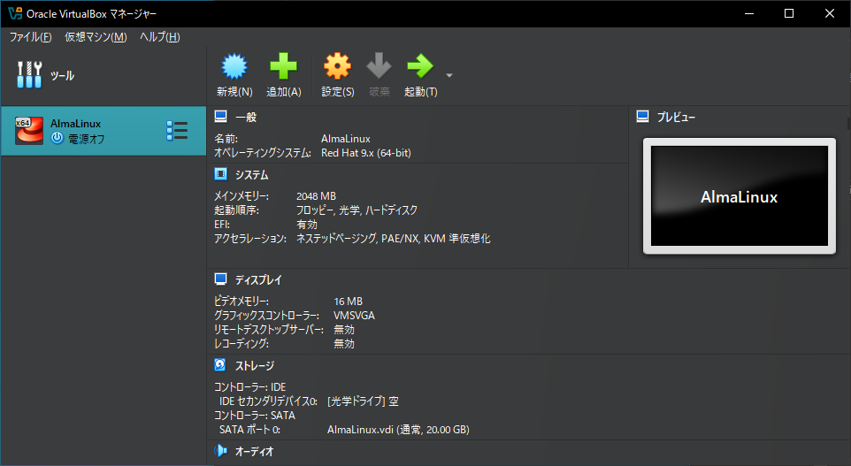
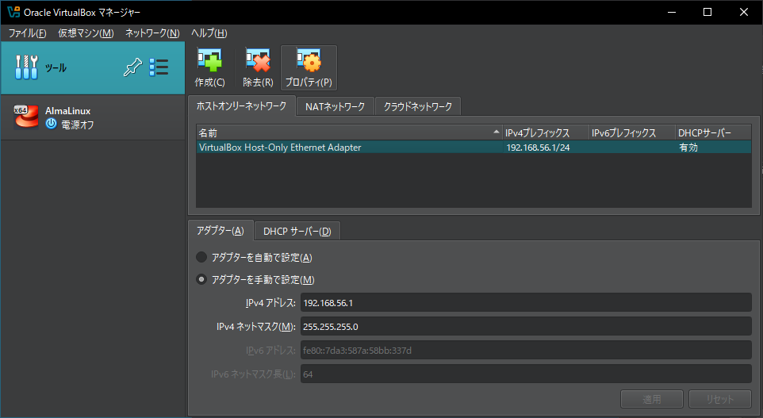
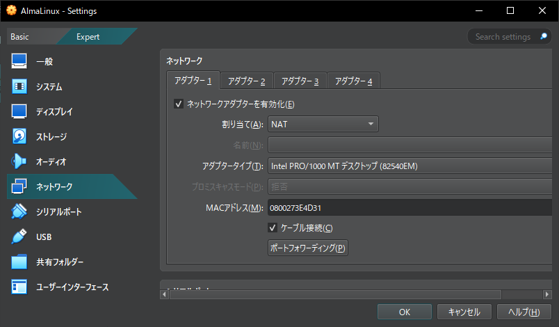
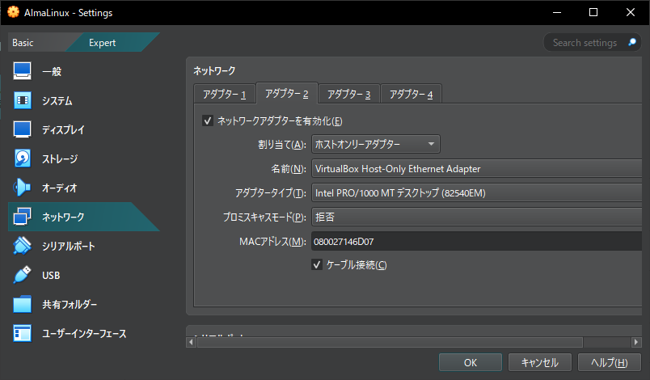
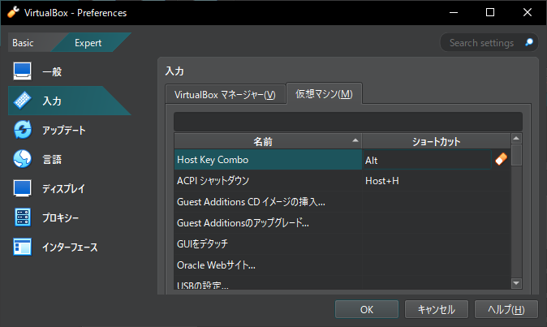

# VirtualBoxのインストールと仮想マシンの作成
実習を進めるためには、Linuxを実際に操作できる環境が必要となります。実習環境は様々なものがありますが、本教科書では手軽に準備できる仮想マシンを使用します。

本章では、実習環境の準備としてVirtualBoxをインストールして、仮想マシンを作成します。


本章の内容

- 仮想マシンとは
- VirtualBoxのインストール
- VirtualBoxの起動
- 仮想マシンの作成
- ネットワークの追加
- ホストキーによるホストOSの操作への復帰

## 仮想マシンとは
仮想マシンは、ソフトウェアで仮想的なマシンを実行する仕組みです。仮想マシンにはゲストOSとしてLinuxをインストールし、操作することができます。

仮想マシンを使うのには、以下のようなメリットがあります。

### 学習用のハードウェアを別途用意する必要がない
仮想マシン用のソフトウェアは、普段使用しているWindowsなどのホストOS上でアプリケーションとして実行されるので、別途Linux用のハードウェアを用意する必要がありません。

### その他のアプリと同時実行できる
仮想マシンと同時にホストOS上でその他のアプリケーションも実行できます。たとえば、本教科書のPDF版を表示しながら実習を進める、ということが簡単に行えます。

### ホストOSのアプリケーションからゲストOSにネットワーク接続できる
ホストOSとゲストOSはネットワークで接続されています。ホストOS上で実行しているWebブラウザから、ゲストOSで実行しているWebサーバーに接続する、といったことができます。

### メモリやストレージの容量に注意
仮想マシンに対するCPUやメモリ、ストレージなどのリソースの割り当ては自由に決められます。学習用にLinuxを動かす仮想マシンにはそれほど沢山のリソースは必要ありませんが、大体以下のようなリソースの割り当てが必要になります。

| リソース | 割当量
| - | -
| CPU | 1から2
| メモリ | 2GB
| ストレージ | 20GB

本教科書では、CPUの負荷が高い処理は行わないのであまり気にする必要はありません。メモリとストレージは実際の容量を消費するので、メモリが少ない場合には余計なアプリを停止し、ストレージは不要なデータを削除して空き領域を作る必要があります。

\pagebreak

## VirtualBoxのインストール
本教科書の実習では、仮想マシンソフトウェアである「VirtualBox」上にLinuxを導入します。

### 使用するコンピュータの仮想化支援技術の有効化
VirtualBoxを実行するには、使用するコンピュータが搭載しているプロセッサの仮想化支援技術が有効になっている必要があります。仮想化支援技術は、IntelのCPUではIntel VT、AMDのCPUではAMD-Vと呼ばれます。

仮想化支援技術を有効にするには、コンピュータのBIOS/UEFI設定画面で設定を行います。設定方法の詳細は、使用するコンピュータの説明書などを確認してください。ほとんどの場合、電源を投入後、OSが起動する前にファンクションキーを押して設定画面を呼び出して設定を行います。

### VirtualBoxのダウンロード
VirutalBoxは、次のURLからダウンロードできます。

```
https://www.virtualbox.org/
```

ホストOSの種類に合わせてダウンロードを行えます。今回はWindows環境にインストールします。上部のメニューから「Download」をクリックし、ダウンロードページを表示します。「VirtualBox Platform Packages」から「Windows hosts」をクリックして、インストーラーをダウンロードします。

{width=70%}

今回はバージョン7.1.2を使用しています。

### VirtualBoxのインストーラーの実行
VirtualBoxのインストーラーをダウンロードが完了したら、インストーラーを実行してインストールします。

インストール時の特別な設定は行いませんので、インストーラーの指示に従ってインストールします。インストーラーが仮想ネットワークのインストールについて、またPythonとの連携について確認を取ってきますが、そのまま進めても問題ありません。

インストール終了後、Finishボタンをクリックするとインストーラーが終了し、VirtualBoxが起動します。

## VirtualBoxの起動
VirtualBoxを起動します。

インストーラーが自動で起動した状態ではない場合には、デスクトップ上に追加されたVirtualBoxをダブルクリックして起動します。

VirtualBoxが起動すると、VirtualBoxマネージャーが表示されます。

{width=70%}

### VirtualBoxマネージャー
VirtualBoxマネージャーは、VirtualBoxによる仮想マシン実行環境全体を管理するツールです。主に以下のことが行えます。

- VirtualBox自身の各種設定
- 仮想マシンの管理
- メディア（ISOイメージ等）の管理
- 仮想ネットワークの管理

\pagebreak

## 仮想マシンの作成
実習で使用する仮想マシンを作成します。

VirtualBoxマネージャーの「ようこそVirtualBoxへ！」の画面で「新規(N)」ボタンをクリックし、新しい仮想マシンの作成を開始します。画面が切り替わっている場合には、「ツール」右側のリストボタン（横3本線）をクリックし、「ようこそ」を選択します。

### 仮想マシンの名前とOSの設定
まず最初に、仮想マシンの名前とOSの種類などを設定します。

設定する項目と、設定する内容は以下の通りです。

| 項目 | 設定値
| - | -
| 名前 | AlmaLinux
| タイプ | Linux
| Subtype | Red Hat
| バージョン | Red Hat 9.x (64-bit)

ISOイメージはインストール前に設定するので、ここでは設定しないでおきます。

{width=70%}

設定したら、「＞ハードウェア(A)」をクリックします。

\pagebreak

### 仮想マシンのハードウェアの設定
仮想マシンのハードウェアの設定として、メインメモリーの容量とプロセッサの数を設定します。また、EFIの設定も行います。

| 項目 | 設定値
| - | -
| メインメモリー | 2048MB
| プロセッサー数 | 1
| EFIを有効化(一部のOSのみ) | チェックする

{width=70%}

メインメモリーの容量は、使用しているコンピュータが搭載しているメモリ容量以下に制限されます。仮想マシンにある程度多めのメインメモリーを割り当てることで快適に動作させることができます。デフォルトの2048MBでも動作しますが、余裕があれば4096MB（4GB）割り当ててもよいでしょう。

プロセッサの数は、使用しているコンピュータが搭載しているプロセッサのコア数以下に制限されます。また、プロセッサによっては仮想CPU機能により見かけ上コア数が2倍になっている場合もあります。デフォルトの1つでも動作しますが、余裕があれば2つ割り当ててもよいでしょう。

「EFIを有効化」は、デフォルトではチェックされていません。OSのインストール画面のサイズが合わず一部の画面が見えなくなる問題が発生するため、チェックしておきます。

設定しましたら、「＞ハードディスク(K)」をクリックします。

\pagebreak

### 仮想ハードディスクの設定
OSのインストール先となる仮想ハードディスクを作成します。

| 項目 | 設定値
| - | -
| ハードディスクファイルのサイズ | 20.00GB

{width=70%}

仮想ハードディスクの容量は、使用しているコンピュータが搭載しているストレージの容量以下に制限されます。また、「全サイズの事前割当て(F)」をチェックしない限り、仮想ハードディスクの容量はゲストOSが使用した分だけしか消費しませんので、サイズの設定は最大消費容量を指定することになります。

設定が終わったら、「完了」ボタンをクリックします。

VirtualBoxマネージャーに、新しく作成した仮想マシンが追加されたことを確認します。

{width=70%}

\pagebreak

## ネットワークの追加 
ホストOSと仮想マシン上のゲストOSがネットワークで通信できるようにするため、以下の手順で「ホストオンリーアダプター」を追加します。

デフォルトではNATを使った外部ネットワークに接続するネットワークのみ設定されています。

### 仮想ネットワークの設定を確認
VirtualBoxの仮想ネットワークの設定を確認します。

VirtualBoxマネージャーの「ツール」右側のリストボタン（横3本線）をクリックし、「ネットワーク」を選択します。

「ホストオンリーネットワーク」タブを選択し、「VirtualBox Host-Only Ethernet Adapter」が存在していることを確認します。IPアドレスは、VirtualBoxのインストール時に自動的に作成された場合には「192.168.56.1/24」が設定されています。このIPアドレスは、ホストOSに作成された仮想ネットワークアダプターに割り当てられているIPアドレスです。

DHCPサーバーもデフォルトで有効になっており、インストールしたゲストOSは自動的にIPアドレスが設定されます。

{width=70%}

\pagebreak

### 仮想マシンにネットワークアダプターを追加
仮想マシンにネットワークアダプターを追加します。

VirtualBoxマネージャーから仮想マシンを選択し、右側の各種設定情報から「ネットワーク」を選択します。

仮想マシンには最大4つのネットワークアダプターを設定できます。アダプター1は「NAT」が設定されており、外部のネットワークやその先にあるインターネットに接続できます。

{width=70%}

アダプター2のタブを選択し、「ネットワークアダプターを有効化(E)」をチェックします。「割り当て(A)」を「ホストオンリーアダプター」に設定すると、「名前(N)」に「VirtualBox Host-Only Ethernet Adapter」が設定されます。これによって、この仮想マシンはホストOSと通信が行えるようになります。

設定したら、「OK」をクリックします。

{width=70%}

以上で仮想マシンの作成と設定は完了です。

## ホストキーによるホストOSの操作への復帰
仮想マシンをマウスで操作している際に、ホストOSにマウス操作を戻したくなった場合にはホストキーを押します。デフォルトではキーボード右側のCtrlキーがホストキーに設定されています。ホストキーの設定は、仮想マシンのウインドウの右下にも表示されています。

### ホストキーが押せない場合のホストOSの操作への復帰
ノートパソコンなどキーボードによっては右Ctrlキーが無いためホストキーが押せず、仮想マシンの操作から抜け出せなくなります。そのような状態になった場合には、Ctrl+Alt+Delキーを入力すると強制的にホストOSであるWindows側に制御が移ります。「キャンセル」ボタンをクリックすれば、仮想マシンの操作から抜け出した状態でホストOSの操作が可能になります。

### ホストキーの変更
VirtualBoxマネージャーの環境設定から、ホストキーを変更できます。

ホストキーの変更は、仮想マシンの作成の後でないと行えないので、初めてVirtualBoxをインストールした場合には、仮想マシンの作成を行ってから設定変更を行ってください。

環境設定は、VirtualBoxマネージャーの「ファイル(F)」メニューから「環境設定(P)」を選択して呼び出します。
「環境設定」ウインドウが表示されたら、左側の設定項目から「Expert」に切り替えて「入力」を選択し、「仮想マシン(M)」タブを選択します。一番最初にある「Host Key Combo」の「ショートカット」部分をクリックします。新たにホストキーにしたいキーを押すことで、ホストキーがそのキーに切り替わります。

{width=70%}

ホストキーに設定できるのはCtrlキー、Altキー、Windowsキー、Shiftキー（単独設定不可）です。左のCtrlキーをホストキーに設定してしまうと、コマンドライン操作などの際に重複してしまうので、避けた方がよいでしょう。複数のキーを同時に押す組み合わせをホストキーにすることもできるので、2つないし3つのキーの組み合わせをホストキーとして設定するとよいでしょう。

\pagebreak
