# Linuxのインストールと設定
実習環境を用意するには、作成した仮想マシンにOSををインストールし、初期設定が必要です。

本章では、VirtualBoxで作成した仮想マシンにAlmaLinuxをインストールします。OSインストール後、初期設定とネットワーク接続の確認を行います。

本章の内容
- 利用するLinuxのディストリビューション
- インストール用ISOイメージの入手
- ISOイメージのファイル名
- ISOイメージを仮想光学ドライブで読み込む設定
- 仮想マシンの起動
- OSのインストール


## 利用するLinuxのディストリビューション
本教科書では、AlmaLinux 9.4のIntel/AMD x86_64アーキテクチャに対応したバージョンを利用します。

```
https://almalinux.org/ja/
```

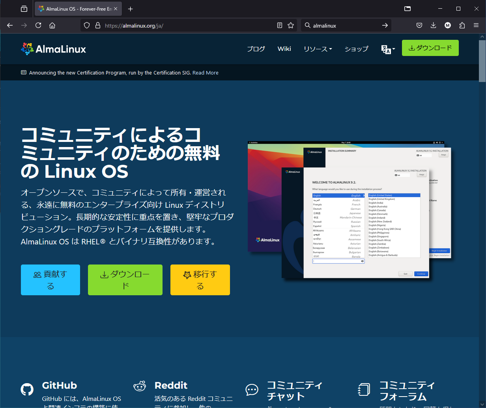{width=70%}

AlmaLinuxは、商用ディストリビューションであるRed Hat Enterprise Linuxをベースにしたディストリビューションとして提供されています。利用に際し費用が発生しない、無償で提供されているディストリビューションです。

\pagebreak

## インストール用ISOイメージの入手
AlmaLinux OS Foundationが配布しているISOイメージを、ダウンロードします。仮想マシンは、仮想光学ドライブにISOイメージをセットすることでインストールが行えるので、インストール用のDVD/USBメモリを作成する必要がありません。

### ダウンロード方法 {.unlisted}
ISOイメージをダウンロードするには、以下のURLにアクセスします。

```
https://mirrors.almalinux.org/isos/x86_64/9.4.html
```

このURLにアクセスすると、多くのミラーサイトが表示されます。例えば、IIJが提供しているミラーサイトのURLであれば次のようになります。

```
http://ftp.iij.ad.jp/pub/linux/almalinux/9.4/isos/x86_64
```

### URLが利用できない場合 {.unlisted}
URLはサイト構造の変更によって変わっている場合があります。その場合には、AlmaLinuxのWebサイトからリンクを辿ってダウンロードサイトを探してください。

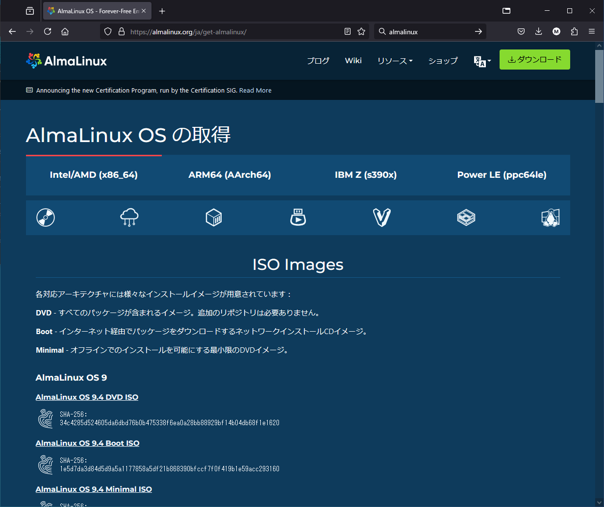{width=70%}

\pagebreak

## ISOイメージのファイル名
ISOイメージは以下のようなファイル名になっています。

```
AlmaLinux-バージョン-アーキテクチャ-イメージの種類.iso
```

今回使用するISOイメージのファイル名は「AlmaLinux-9.4-x86_64-dvd.iso」になります。

### バージョン {.unlisted}
本教科書では、本教科書の作成時点で最新であったAlmaLinux 9.4を利用して解説しています。

今後のバージョンアップで、より新しいバージョンのAlmaLinuxが入手可能になっているかもしれません。バージョン9系であればマイナーバージョンによる大きな差は無いと推測されますが、セキュリティ対応などの関係で動作が変わる場合があります。

初めて本教科書の内容を学習する際には、まずはバージョンを合わせて動作を確認し、その後異なるバージョンで同様に動作するか確認してみてください。バージョンによる動作の違いについては、本教科書の情報交換を行うSlackで情報共有を行い、本教科書の今後のバージョンアップで対応していく予定です。

### アーキテクチャ {.unlisted}
Linuxカーネルは様々な種類のCPUアーキテクチャに対応しています。アーキテクチャによってバイナリが異なるため、アーキテクチャに合わせたISOイメージを選択する必要があります。主なアーキテクチャには以下のものがあります。

- x86_64
IntelやAMDのCPUアーキテクチャです。64ビット版になります。

- aarch64
ARMのCPUアーキテクチャです。64ビット版になります。ARMを搭載したWindowsや、Apple Siliconを搭載したMacを使う場合にはこちらをダウンロードします。

### ISOイメージの種類 {.unlisted}
ISOイメージには、いくつかの種類があります。インストールの目的によってイメージを選択します。AlmaLinuxには以下の3種類のISOイメージが用意されています。

- 起動のみ（boot.iso）
- 最低限（minimal.iso）
- フルパッケージ（dvd.iso）

本教科書の演習では、GUI環境も使用するため、フルインストールが可能なISOイメージ（dvd.iso）を使ってインストールします。

## ISOイメージを仮想光学ドライブで読み込む設定
ダウンロードしたOSインストール用のISOイメージを、仮想マシンの仮想光学ドライブで読み込む設定をします。

VirtualBoxマネージャーから仮想マシンを選択し、右側の各種設定情報から「ストレージ」を選択します。

仮想マシンには、IDEとSATAの2種類のストレージデバイスが接続されています。仮想光学ドライブはIDEに接続されています。読み込む設定が何もされていない場合、「空」と表示されているのが仮想光学ドライブですので、選択します。

「光学ドライブ:IDE セカンダリデバイス0」の右側にある円形のボタンをクリックし、「Choose a Disk File...」を選択すると、ファイルダイアログが開きます。準備しておいたOSインストール用のISOイメージを選択し、「開く」ボタンをクリックします。「空」の表示がファイル名に変わります。

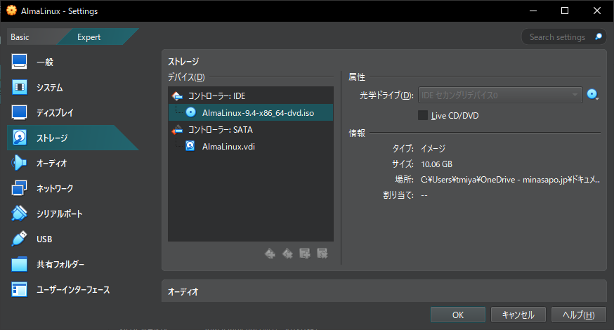{width=70%}

\pagebreak

## 仮想マシンの起動
VirtualBoxマネージャーで仮想マシンを選択し、「起動」をクリックします。別ウインドウで仮想マシンが起動します。

ISOイメージからインストーラーが読み込まれて、OSのインストールを行えるようになります。

### ISOイメージファイルのマウント {.unlisted}
あらかじめ仮想マシンの仮想光学ドライブにISOイメージを読み込ませる設定をしていない場合、起動用のISOイメージを設定するダイアログが表示されます。

画面の指示に従って、ISOイメージのファイルを指定し、「マウントとブートのリトライ」ボタンをクリックして起動します。

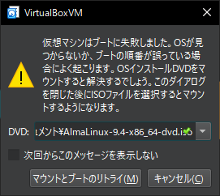

\pagebreak

## OSのインストール
以下の手順に従って、OSのインストールを行います。

### インストーラ起動オプションの選択 {.unlisted}
OSインストール用のISOイメージを読み込んで起動すると、最初にGRUBというブートローダーが起動します。ここでインストーラの起動オプションを選択できます。

デフォルトの「Test this media & Install AlmaLinux 9.4」で起動し、ISOイメージが壊れていないかテストを行った上でインストールを行います。すでに選択されているので、Enterキーを押します。

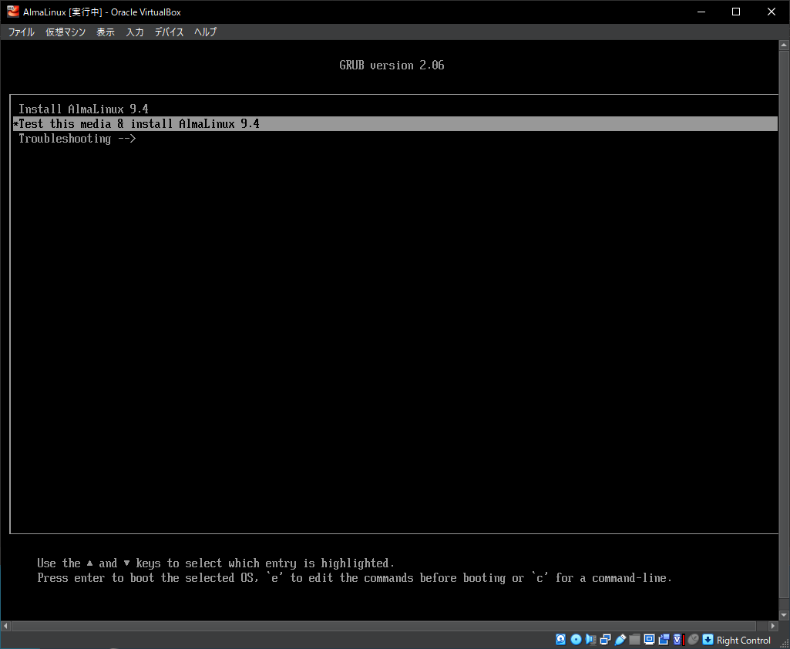{width=70%}

\pagebreak

### 言語選択 {.unlisted}
言語の選択画面が表示されるので、左側のメニューから「日本語 Japanese」を選択します。画面右側のメニューに「日本語（日本）」が表示されます。

「続行」ボタンをクリックします。

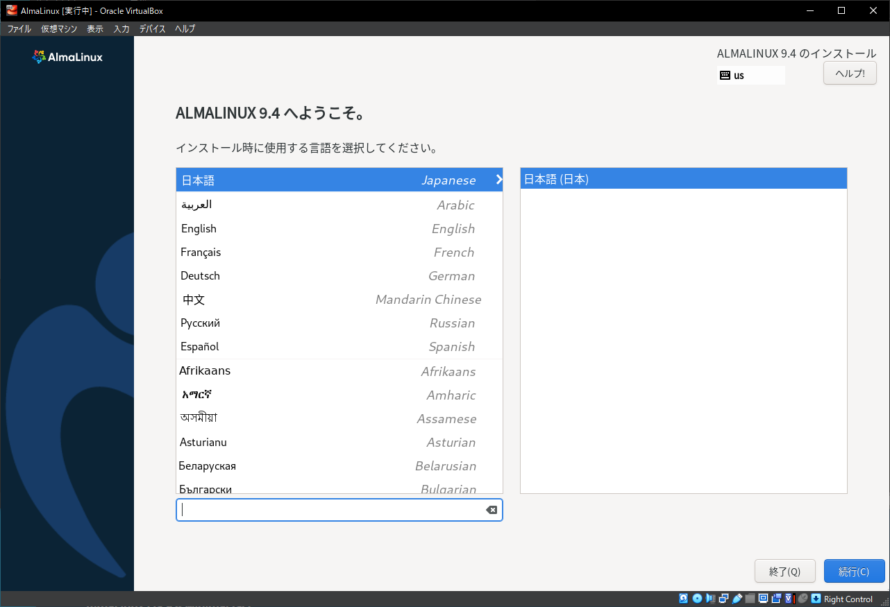{width=70%}

### インストール概要 {.unlisted}
インストール概要の画面では、各種設定がまとめて表示されます。

「!」が付いた項目は、必ず設定が必要な項目です。

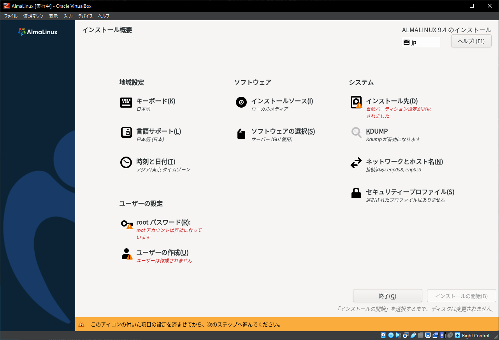{width=70%}

\pagebreak

### インストール先の設定 {.unlisted}
「インストール先」をクリックします。画面が切り替わり、「デバイスの選択」や「ストレージの設定」が行えます。

デフォルトで、仮想マシン作成時に新規作成した仮想ハードディスクがローカル標準ディスクとして選択されています。また、そのデバイスのパーティション設定は自動構成が選択されています。

今回はデフォルトのままインストール先を設定するので、そのまま「完了」ボタンをクリックします。

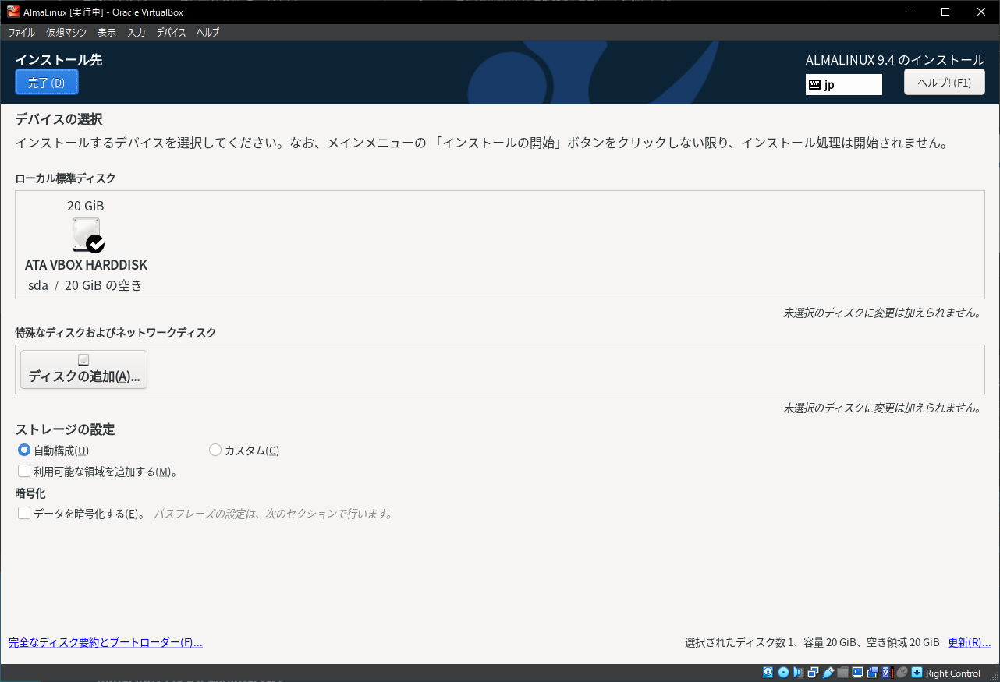{width=70%}

\pagebreak

### ソフトウェアの追加インストール {.unlisted}
「ソフトウェアの選択(S)」をクリックします。画面が切り替わり、大まかな用途を決める「ベース環境」と、追加でインストールするソフトウェアが選択できます。実習で利用するソフトウェアをあらかじめインストールしておきます。

ベース環境は「サーバー（GUI使用）」を選択します。右側の「選択した環境用のその他のソフトウェア」リストから、インストールしたいソフトウェアとして「ベーシックWebサーバー」をチェックして追加でインストールします。

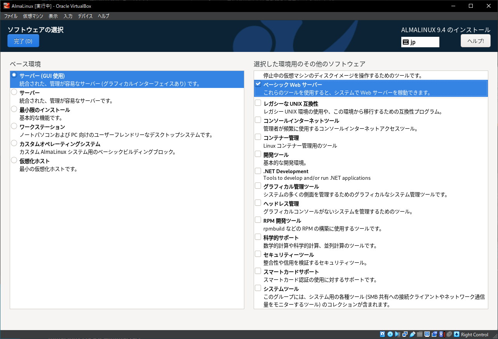{width=70%}

\pagebreak

### ユーザーの作成 {.unlisted}
「ユーザーの作成(U)」をクリックします。実習で使用するユーザーを作成います。

| 項目 | 設定値
| - | -
| フルネーム | LinuC
| ユーザー名 | linuc
| このユーザーを管理者にする | チェックする
| このアカウントを使用する場合にはパスワードを要求する | チェックする
| パスワード | 任意のパスワードを設定
| パスワードの確認 | 設定したパスワードを再入力

パスワードは、入力間違えが無いように「パスワード(P)」と「パスワードの確認(C)」に同じパスワードを2回入力します。長さや大文字小文字数字を混ぜるなど一定の要件を満たさないと脆弱なパスワードと判定されます。良好以上になるパスワードを入力するか、脆弱と判定された場合には「完了(D)」ボタンを2回クリックする必要があります。

ユーザーの作成の設定が完了したら、「完了(D)」ボタンをクリックします。

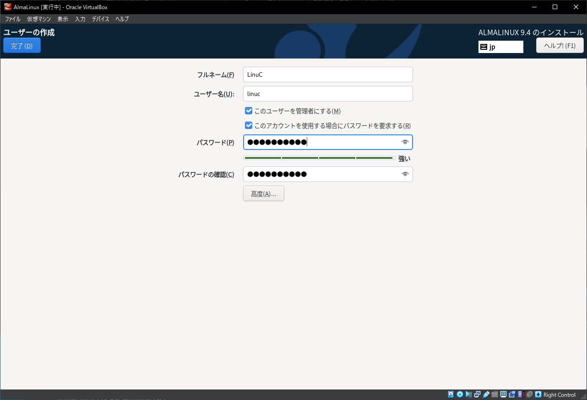{width=70%}

\pagebreak

### インストールの開始 {.unlisted}
必要な設定が終わったら、インストールを開始します。「インストールの開始(B)」ボタンをクリックします。

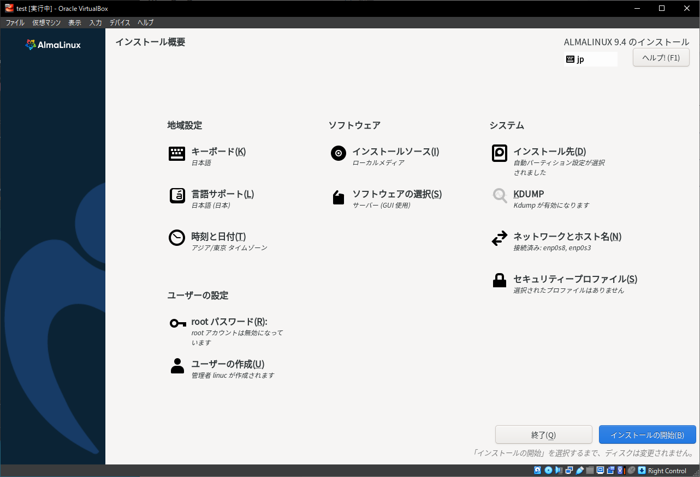{width=70%}

インストールが始まり、「インストール状況の表示」画面が表示されます。

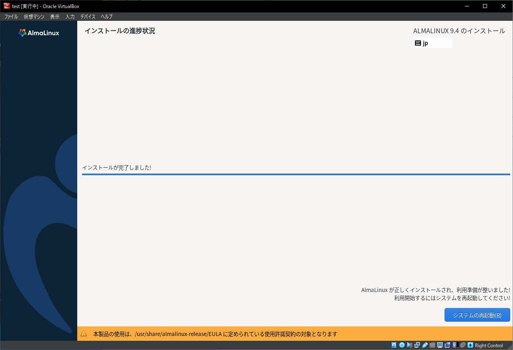{width=70%}

インストールが終了したら、「システムの再起動」ボタンをクリックして、再起動します。

\pagebreak
