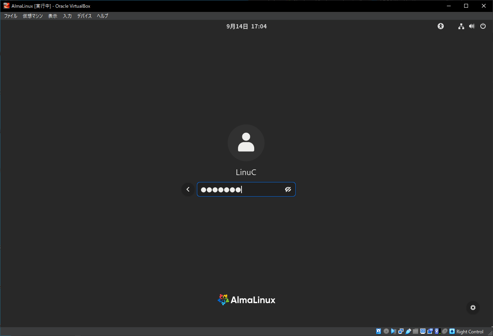
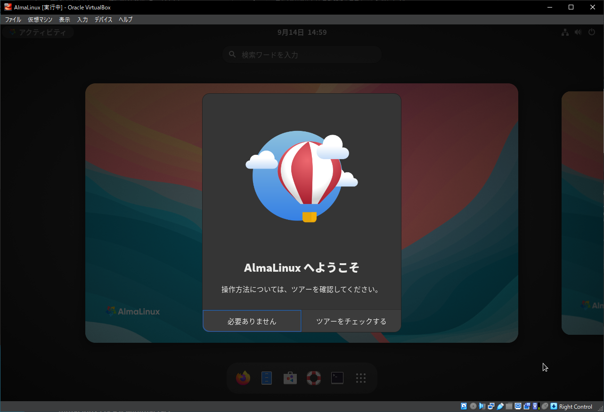
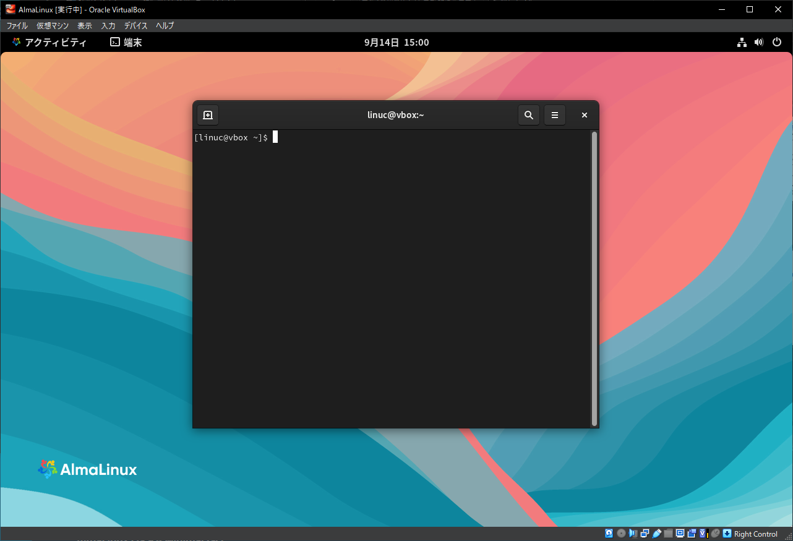
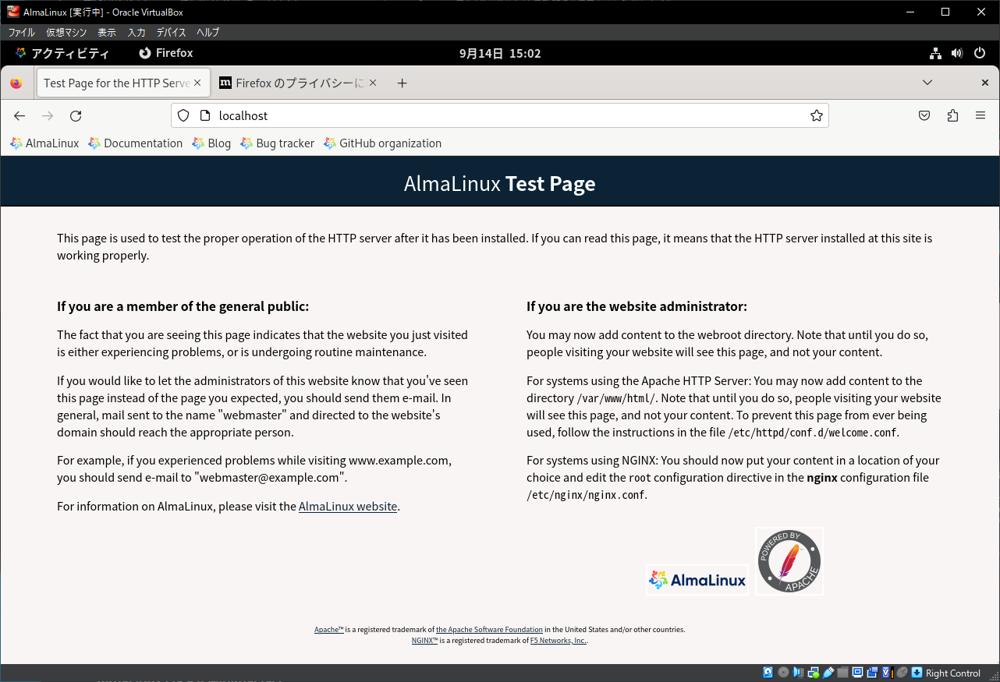
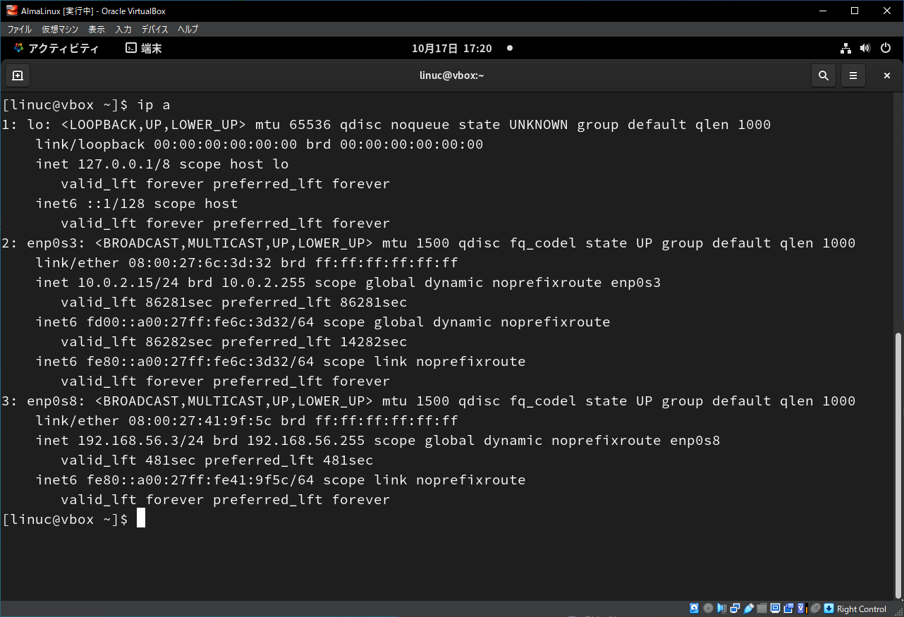
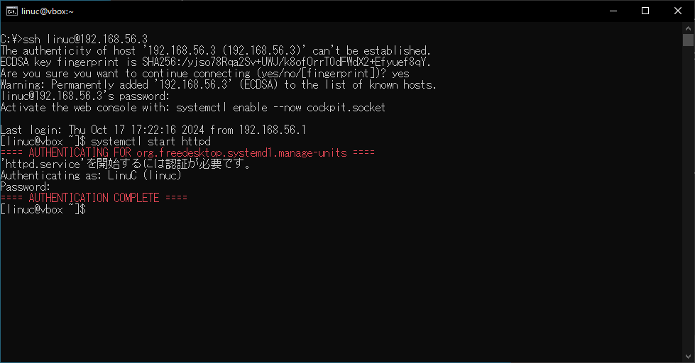

# Linuxを操作してみよう
Linuxのインストールが終わったら、コマンド操作などについて学んで行く前に、簡単に操作をしてみましょう。

本章では、ログインからコマンド実行、Webサーバーを動かすための手順と、実習を行いやすくするためのSSHによるリモートログインについて解説します。

本章の内容
- GUIによるログインとログアウト
- コマンド実行のための端末を起動
- Webサーバーを動かしてみる
- SSHでリモートログインする


## GUIによるログインとログアウト
Linuxを使い始めるにはログインを、使い終わったらログアウトを行います。

システムが起動したら、ログインとログアウトを試してみましょう。

### GUIでログインする
ログインするには、ログインしたいユーザーをクリックし、パスワードを入力します。

{width=70%}

初回ログイン時には「AlmaLinuxへようこそ」と表示され、操作方法を確認するツアーを開始できます。ツアーを見たい場合には「ツアーをチェックする」ボタンをクリックします。はじめてAlmaLinuxのGUIを操作するのであれば、短いツアーですのでチェックしてみてください。

{width=70%}

\pagebreak

### GUIでログアウトする方法
ログアウトするには、画面右上にあるメニューバーの電源アイコンをクリックし、「電源オフ/ログアウト」をクリックすると表示される「ログアウト」をクリックします。

ログアウトを確認するダイアログが表示されるので、「ログアウト」をクリックします。

## コマンド実行のための端末を起動
コマンドを実行してLinuxを操作するために「端末」アプリを起動します。

再度ログインを行い、画面左上の「アクティビティ」をクリックし、画面下に表示されるアイコンから「端末」アプリのアイコンをクリックします。

{width=70%}

## Webサーバーを動かしてみる
Linuxでは、コマンドを実行して各種サービスの起動や停止を行います。ここでは、OSインストール時に追加で導入したWebサーバーを起動して、Webブラウザからアクセスしてみます。

### Webサーバーを起動する
Webサーバーを起動します。Webサーバーは、Linuxではhtttpdサービスと呼ばれています。サービスの起動や停止はsystemctlコマンドを実行して行います。

Webサーバーのようなサービスは、実行するためにはLinuxのシステム管理者のユーザー権限が必要になります。システム管理者やユーザー権限については第7章で解説します。

「端末」アプリのコマンドプロンプトで、systemctlコマンドを実行します。

```
$ systemctl start httpd
```

systemctlコマンドを実行すると、システム管理者のユーザー権限があることを確認するためにユーザーlinucのパスワードを要求するダイアログが表示されるので、パスワードを入力します。OSインストール時の「ユーザーの作成」でユーザーlinucを作成する際に「このユーザーを管理者にする」をチェックしているので、ユーザーlinucのパスワードを入力することでシステム管理者のユーザー権限があることを確認できます。


★スクショ

### Webサーバー起動の確認とコマンド履歴
認証に成功すると、httpdサービスが起動します。実行結果が何も表示されていないので、起動されたことを確認するため、systemctl statusコマンドを実行します。

コマンドプロンプトには、コマンド履歴という機能があります。以前に実行したコマンドを呼び出してそのまま実行したり、修正して実行したりできます。カーソルキーの上下でコマンド履歴を呼び出し、修正する場合にはカーソルキーの左右でカーソルを動かし、DeleteキーやBackSpaceキーで文字を消すことができます。

カーソルキーの上を押して「systemctl start httpd」コマンドを呼び出し、「start」を消して「status」に書き換えて実行します。

```
$ systemctl start httpd
```
↓
```
$ systemctl sta httpd ※カーソルを左に移動してrtを削除
```
↓
```
$ systemctl status httpd ※tusを追加して実行
```

実行結果の「Active:」の項目が「active (running)」になっていれば、httpdサービスが実行中であることがわかります。サービスはいくつかのプロセスとしてバックグラウンドで実行されています。プロセスについては第10章で解説します。確認を終えたら「q」（Quit）キーを入力して表示を終了します。

### WebブラウザでWebサーバーにアクセスする
Webブラウザを起動して、Webサーバーにアクセスしてみます。

画面左上の「アクティビティ」をクリックし、画面下に表示されるアイコンから一番左にある「Firefox」アプリのアイコンをクリックします。

Webブラウザのウインドウが表示されたら、アドレスに「localhost」と入力して、Enterキーを押します。「AlmaLinux Test Page」が表示されたら、Webサーバーにアクセスできたことが確認できます。

{width=70%}

### Webサーバーを停止してみる
Webサーバーを停止してみます。

画面左上の「アクティビティ」をクリックし、画面に表示されるウインドウから「端末」アプリのウインドウをクリックします。

コマンドプロンプトで、systemctl stopコマンドを実行します。コマンド履歴を使って実行してみてください。

```
$ systemctl stop httpd
```

再度、ユーザーlinucのパスワード認証が要求されるので、パスワードを入力します。再度systemctl statusコマンドで確認すると、「Active:」の項目が「inactive (dead)」になっています。Webブラウザで再読み込みを行うと「正常に接続できませんでした」と表示されます。

再度、systemctl startコマンドで起動し直して、正常な状態に戻るのも確認してみてください。

このように、Linuxの操作は様々なコマンドを実行して操作を行います。

## SSHでリモートログインする
Linuxが動作しているマシンが手元にある場合にはGUIで直接ログインできますが、多くの場合Linuxが動作するマシンはデータセンターやマシンルームの中に設置されていたり、クラウド上で動作しています。このようにリモートにあるLinuxを操作するには、SSHでリモートログインする必要があります。

本教科書の実習は基本的にGUIで直接ログインし、「端末」アプリのコマンドプロンプトで進めることができますが、リモート操作に慣れるためにホストOSからゲストOSにSSHでリモートログインしてみることをお勧めします。

### LinuxのIPアドレスを調べる
事前にLinuxでipコマンドを実行して、ログイン先のIPアドレスを調べてみます。

「端末」アプリのウインドウ内にコマンドプロンプトが表示されているので、コマンドを入力し、Enterキーを押して実行します。「ip a」コマンドは、実行したマシンに割り当てられているIPアドレスなどの情報を表示します。

```
$ ip a
```

実行した仮想マシンには、ネットワークアダプターを2つ設定しています。自分自身に接続する「ローカルループバック」を含めて、3つのネットワークインターフェースの情報が表示されます。IPアドレスは「inet」で始まる行に記述されています。

```
$ ip a
（略）
3: enp0s8: <BROADCAST,MULTICAST,UP,LOWER_UP> mtu 1500 qdisc fq_codel state UP group default qlen 1000
    link/ether 08:00:27:a2:d5:45 brd ff:ff:ff:ff:ff:ff
    inet 192.168.56.3/24 brd 192.168.56.255 scope global dynamic noprefixroute enp0s8
（略）
```

「192.168.56.x/24」はホストオンリーネットワークに設定したアダプターのIPアドレスです。DHCPで動的に割り当てられるため、第4オクテットは変わる場合があります。

ホストOSとゲストOSを接続するにはホストオンリーネットワークを経由する必要があります。SSHのログイン先のIPアドレスはこの「192.168.56.x」になります。

{width=70%}

### WindowsからSSHを行う方法
Windowsから仮想マシン上で動作するLinuxにSSHでリモートログインするには、Windows側でSSHクライアントを実行する必要があります。方法としては、以下の2つの方法があります。

- WindowsでコマンドプロンプトやPowerShellを実行し、sshコマンドを実行する
- Tera TermなどのSSHプロトコルをサポートしたソフトウェアを導入する

今回はWindowsの標準機能であるsshコマンドを使ってみます。

### Windowsのコマンドプロンプトを実行する
Windowsのコマンドプロンプトを実行します。タスクバーの検索ウインドウに「cmd」と入力し、候補として出てきた「コマンドプロンプト」を実行します。

タスクバーに検索ウインドウが無い場合には、タスクバーを右クリックして「タスクバーの設定」から、検索ウインドウを表示するように設定してください。

### sshコマンドでゲストOSに接続する
コマンドプロンプトでsshコマンドを実行して、ゲストOSのLinuxに接続します。

書式
ssh ユーザー名@接続先IPアドレス

以下の例では、ユーザーlinucで192.168.56.2に接続しようとしています。

```
>ssh linuc@192.168.56.3
The authenticity of host '192.168.56.2 (192.168.56.3)' can't be established.
ED25519 key fingerprint is SHA256:xW65Q1rynI7tb8LmiZrmu1X1O0sc8Zf/csbfsAx8Hfs.
This key is not known by any other names
Are you sure you want to continue connecting (yes/no/[fingerprint])? yes ※yesと入力
Warning: Permanently added '192.168.56.2' (ED25519) to the list of known hosts.
linuc@192.168.56.2's password: ※ユーザーlinucのパスワードを入力（非表示）
Activate the web console with: systemctl enable --now cockpit.socket

Last login: Sun Sep 15 09:49:18 2024
[linuc@vbox ~]$
```

初めてSSHで接続する場合、接続先のホスト証明書が送られてきます。接続を続ける場合には「yes」と入力します。その後、ユーザーlinucのパスワードが要求されるので、パスワードを入力すると接続が完了します。

コマンドプロンプトが表示されれば、GUIの「端末」アプリで実行するのと同じようにコマンドを実行できます。ただし、GUIがないのでsystemctlコマンドの認証がダイアログではなくなるなどの違いがあります。

```
$ systemctl start httpd
==== AUTHENTICATING FOR org.freedesktop.systemd1.manage-units ====
'httpd.service'を開始するには認証が必要です。
Authenticating as: LinuC (linuc)
Password:
==== AUTHENTICATION COMPLETE ====
```

{width=70%}

\pagebreak
