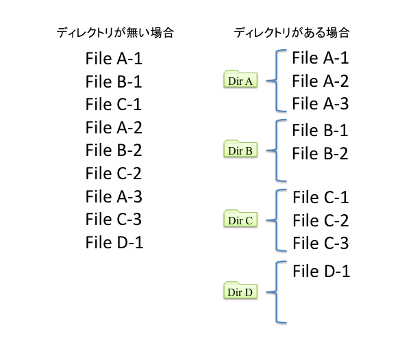

# 基本的なコマンド
Linuxをコマンドで操作するには、ファイルやディレクトリの操作を行えることが基本となります。

本章では、ファイルやディレクトリを操作するコマンドやLinuxを利用する上で必要な基本的なコマンドを学習します。

本章の内容

- ファイルとディレクトリの参照
- ファイルの内容を表示
- 空のファイルを作成する
- ディレクトリの操作
- 特別なディレクトリ
- ファイルのコピー(cpコマンド)
- ファイルの移動(mv)
- ファイルの削除(rm)
- ファイルの検索（find）
-コマンドのパスを表示（whichコマンド）
- コマンドのヘルプを表示する
- マニュアルの使い方


## ファイルとディレクトリの参照
Linuxは、コマンドやプログラム、設定ファイルなど様々なファイルでシステムを構成しています。また、それらのファイルを目的別に分類するため、様々なディレクトリに分けて格納しています。これらのファイル、ディレクトリを参照するのは、Linux操作の基本です。

ファイルやディレクトリの一覧を取得するにはls(LiSt)コマンドを使用します。

### ファイルとディレクトリ
コンピュータの基本的な作業は、情報（＝データ）を処理することにあります。データをコンピュータ上に保存しておく方法として、ファイルという形式が用いられます。文書を作成したら文書ファイルを保存しますし、デジカメで写真を撮ったら画像ファイルを保存する、といった具合です。

ファイルの数が増えると、内容や用途といった目的別に分ける必要が出てきます。このときに必要なものが、ディレクトリという考え方です。ディレクトリは、複数のファイルをまとめて保存できます。また、ディレクトリの中にディレクトリを作成することも可能です。

{width=50%}

\pagebreak

### lsコマンドによるファイルやディレクトリの参照
lsコマンドでは、引数（ひきすう）として指定したファイルやディレクトリの情報を取得できます。ディレクトリを指定した場合、そのディレクトリの中にあるファイルやディレクトリの一覧を取得できます。引数を省略した場合、カレントディレクトリの情報を取得します。

```
書式
ls [オプション] [ファイルまたはディレクトリ]

オプション
-a
.で始まる隠しファイル等もすべて(All)出力します。

-l
詳細(Long)形式で出力します。

-R
指定したディレクトリ以下すべてを出力します。
このオプションのように「指定したディレクトリ以下すべて」という動作を
「再帰」（recursive）と呼びます。同じような再帰の動作をするオプションは
-R、または-rになることが多くあります。
```

現在作業しているディレクトリ（カレントディレクトリ）内にあるファイルやディレクトリの一覧を表示してみましょう。いくつかのディレクトリがあることがわかります。

```
$ ls
ダウンロード デスクトップ ビデオ 画像
テンプレート ドキュメント 音楽   公開
```

lsコマンドの後に引数としてファイルやディレクトリを指定した場合、指定したディレクトリ内にあるファイルやディレクトリを一覧表示できます。以下の実行例では/usrディレクトリ内を参照しています。

```
$ ls /usr
bin  games  include  lib  lib64  libexec  local  sbin  share  src  tmp
```

### 書式
書式とは、そのコマンドが用いられる形式を示しています。コマンド実行時に指定できるオプションや引数などの要素を、どのように指定するかを示しています。

本教科書では、初めて出てくるコマンドには書式を記述しています。[]でくくられている場合、そのオプションや引数は省略可能です。省略された場合、デフォルトの設定が暗黙に指定されて動作します。

本教科書に記述している書式やオプションは、実習を行う上での最低限のものになっています。より詳しい書式やオプションについてはマニュアル等を参照してください。

### オプション
コマンドはオプションを指定することで、その動作を変更できます。

オプションには、-（ハイフン）に1文字だけ指定する形式、ハイフンが不要な形式、ハイフンが2つに単語で指定する形式があります。使用可能なオプション形式はコマンドによって異なります。

本教科書では、ある動作をさせるためのコマンドとしてオプションまでまとめて表記する場合があります。

\pagebreak

### サブコマンド
比較的新しく作られたコマンドでは、サブコマンドを指定して動作を変更するものもあります。サブコマンドという名称自体、定義された正式な名称ではありませんが、本教科書では便宜上このように呼んでいます。

たとえば、サービスの起動や停止を行うsystemctlコマンドは、startやstopなどのサブコマンドを指定して実行します。

```
書式
systemctl [オプション] サブコマンド ユニット

サブコマンド
start
指定したサービスユニットを開始する

stop
指定したサービスユニットを停止する

status
指定したサービスユニットの状態を表示する
```

systemctlはサブコマンドを省略できません。このような場合、本教科書では「systemctl startコマンド」のようにサブコマンドまでまとめて表記する場合があります。

ユニットとはsystemctlコマンドが操作の対象とするもので、たとえばhttpdサービスユニットなどがあります。次に説明する引数に相当します。

### 引数（ひきすう）
コマンドの実行対象となるファイルやディレクトリなどを引数として指定します。引数を省略した場合、デフォルトの値が適用されます。引数を省略できないコマンドや、引数を必要としないコマンドもあります。

### ls -lコマンドの実行
-lオプションを付けてlsコマンドを実行した場合、詳細な形式で出力されます。

```
$ ls -l
合計 0
drwxr-xr-x. 2 linuc linuc 6  8月 10 15:09 ダウンロード
drwxr-xr-x. 2 linuc linuc 6  8月 10 15:09 テンプレート
（略）
```

### ドットファイルの表示
Linuxでは、ファイル名が「.」（ドット）で始まるドットファイルという形式があります。ドットファイルは通常のlsコマンドでは表示されない隠しファイルとなっています。ドットファイルは様々なアプリケーションの設定などを補完するために利用されています。

ドットファイルを表示するには、-aオプションを付けてlsコマンドを実行します。以下の例では詳細形式の-lオプションと一緒に実行しています。

```
$ ls -la
合計 24
drwx------. 14 linuc linuc 4096  8月 10 15:09 .
drwxr-xr-x.  3 root  root    19  8月 10 15:05 ..
-rw-r--r--.  1 linuc linuc   18  4月 30 23:14 .bash_logout
-rw-r--r--.  1 linuc linuc  141  4月 30 23:14 .bash_profile
（略）
```

「.」や「..」、「.bash_logout」などのドットファイルが表示されているのが分かります。

### オプションの同時指定と順序
オプションは、まとめてもまとめなくても同じ結果になります。さらに、順不同なので入れ替えても同じ結果になります。

```
$ ls -la
$ ls -al
$ ls -l -a
$ ls -a -l
```

ただし、ごく一部のコマンド（tarコマンドなど）では指定方法が決まっている場合があります。マニュアルやヘルプで確認してください。

### ワイルドカードを使った絞り込み
ワイルドカードを使うと、引数で指定するファイルやディレクトリの絞り込みが行えます。ワイルドカードには、「*」（アスタリスク）と「?」の2種類があります。

| ワイルドカード | 動作
| - | -
| * | 0個以上の文字列
| ? | 1文字

まずは/etcディレクトリ上にあるファイルやディレクトリの一覧を表示してみましょう。

```
$ ls /etc
DIR_COLORS               gnupg                     pm
DIR_COLORS.lightbgcolor  groff                     pnm2ppa.conf
（略）
```

/etcディレクトリには、多くのファイルやディレクトリが存在していることがわかります。ワイルドカードを使って絞り込んでリスト表示してみましょう。

/etcディレクトリ内の.confファイルを絞り込んで表示するには、以下のように指定します。

```
$ ls /etc/*.conf
anthy-unicode.conf  kdump.conf      nsswitch.conf   sysctl.conf
appstream.conf      krb5.conf       pbm2ppa.conf    updatedb.conf
（略）
```

「*.conf」と指定することで、.confで終わるファイルがリスト表示されました。

ファイル名の文字数がわかっている場合は「?」を使って絞り込めます。?は一個につき何らかの1文字を示します。

以下の例では、ファイル名が「3文字.conf」のファイルが検索結果として出力されます。

```
$ ls /etc/???.conf
yum.conf
```

yum.confが条件に合うファイルとして表示されました。

\pagebreak

## ファイルの内容を表示
ファイルの内容を表示するコマンドについて説明します。単純にファイルの内容を表示するcatコマンドと、ページ単位で表示するlessコマンドがあります。

### ファイルの内容を表示(catコマンド)
cat（conCATenate）コマンドは、本来は引数に指定された複数のファイルを連結（concatenate）して出力するコマンドですが、ファイルを1つだけ指定して内容を表示するコマンドとして使用されることが多いです。

```
書式
cat ファイル名

オプション
-n
行番号を付加して表示します。
```

ホームディレクトリ内のファイル.bashrcを確認してみましょう。

```
$ cat ~/.bashrc
# .bashrc

# Source global definitions
if [ -f /etc/bashrc ]; then
	. /etc/bashrc
fi
（略）
```

-nオプションを付けることで、行番号を付けて表示できます。

```
$ cat -n ~/.bashrc
     1	# .bashrc
     2
     3	# Source global definitions
     4	if [ -f /etc/bashrc ]; then
     5		. /etc/bashrc
     6	fi
（略）
```

\pagebreak

### ページャを使った表示
catコマンドを使ってファイルの内容を表示するとき、行数が多いと表示が流れてしまいます。コマンドラインを実行する端末は多くの場合表示行数は25行に設定されているため、25行以上の行は流れてしまってスクロールさせないと確認できません。

たくさんの行があっても、画面制御を行なってスクロールを途中で止めてくれる機能のことをページングといい、それを実現するコマンドをページャといいます。

代表的なページャとしてはlessコマンドがあげられます。lessコマンドは、引数にページング表示したいファイルを指定します。引数を省略した場合、標準入力から入力されたものをページング表示します。標準入力は6章で解説します。

```
書式
less [ファイル]
```

lessコマンドの操作

| キー | 動作
| - | -
| スペース | 次のページに進む
| b | 前の一画面に戻る
| f | 次の一画面に進む
| ↑ | 前の行に進む
| ↓| 	次の行に進む
| /単語 | 単語を検索します。nキーで検索結果をジャンプします
| q | ページャコマンドを終了(Quit)します。

ページャを使って、たくさんの行があるファイルの表示を行います。さまざまなキーを入力して動作を確認した後、「q」キーを入力して終了させてください。

```
$ less /etc/services
```

## 空のファイルを作成する
touchコマンドを実行すると、ファイルサイズが0バイトの空のファイルを作成できます。

touchコマンドは本来、ファイルの更新日を変更するコマンドですが、存在しないファイルを引数に指定して実行すると空のファイルが作成されます。今後の実習では、ファイル操作のテスト用ファイルを作成するのに使用します。

```
書式
touch ファイル名

$ touch test
$ ls -l test
-rw-r--r--. 1 linuc linuc 0  8月 18 10:41 test
```

testファイルが作成されました。ファイルの中身は空なので、サイズが0バイトになっています。

## ディレクトリの操作
ディレクトリの操作に使われるコマンドとして、pwd、cd、mkdir、rmdirについて説明します。 

### カレントディレクトリの表示(pwdコマンド)
pwd(Print Working Directory)コマンドは、現在作業を行っているカレントディレクトリを表示します。

以下の例では、ログイン直後、端末を起動した直後のカレントディレクトリを表示しています。

```
$ pwd
/home/linuc
```

カレントディレクトリが/home/linucであることがわかります。「/」はディレクトリの区切りを示す記号です。

### ディレクトリの変更(cd)
cd(Change Directory)コマンドを実行すると、現在いるディレクトリを変更することができます。

引数として移動先のディレクトリを指定します。ディレクトリを指定しない場合はホームディレクトリに移動します。引数に「-」（ハイフン）を指定すると、1つ前のカレントディレクトリに戻ります。

```
書式
cd [ディレクトリ]
```

以下の例では、pwdで現在いる場所を確認しながらcdコマンドでディレクトリの移動を行ないます。

現在のディレクトリを確認します。
```
$ pwd
/home/linuc
```

/usrディレクトリに移動します。
```
$ cd /usr
$ pwd
/usr
```

引数無しでcdコマンドを実行すると、ホームディレクトリに移動します。
```
$ cd
$ pwd
/home/linuc
```

cd -コマンドで1つ前のディレクトリだった/usrディレクトリに戻します。
```
$ cd -
$ pwd
/usr
```

cdコマンドだけを実行すると、ホームディレクトリに戻ります。「-」を指定すると、その前にカレントディレクトリだった/usrに戻ります。間違えてカレントディレクトリを変更してしまった場合などに使用するとよいでしょう。

### ディレクトリの作成(mkdir)
mkdirコマンドを実行すると、ディレクトリを作成できます。引数として作成するディレクトリ名を指定します。

```
書式
mkdir ディレクトリ名

オプション
-p
指定されたディレクトリの上位ディレクトリも作成する
```

以下の例では、ホームディレクトリにディレクトリdir1を作成し、dir1の下にディレクトリdir2を作成しますが、mkdirコマンドを2つに分けて実行しました。これは、ディレクトリを作るときはその上位層ができていないと作成できない、という制約があるためです。

lsコマンドに-Rオプションをつけて実行すると、指定したディレクトリ以下のすべてを再帰的に表示することができます。

```
$ cd
$ pwd
/home/linuc
$ mkdir dir1
$ mkdir dir1/dir2
$ ls -R dir1
dir1:
dir2

dir1/dir2:
```

mkdirコマンドに-pオプションを付けて実行すると次のように一度に実行できます。

```
$ mkdir dir3/dir4
mkdir: ディレクトリ `dir3/dir4' を作成できません: そのようなファイルやディレクトリはありません
$ mkdir -p dir3/dir4
$ ls -R dir3
dir3:
dir4

dir3/dir4:
```

### ディレクトリの削除(rmdir)
ディレクトリを削除するには、rmdirコマンドを使用します。

```
書式
rmdir ディレクトリ名

オプション
-p
指定した階層までのディレクトリを一括で削除します。
```

rmdirは、ディレクトリの中にファイルやディレクトリが存在していると、ディレクトリは削除できません。

```
$ ls
dir1  ダウンロード  デスクトップ  ビデオ  画像
dir3  テンプレート  ドキュメント  音楽    公開
$ ls -R dir1
dir1:
dir2

dir1/dir2:
```

dir1を削除してみます。

```
$ rmdir dir1
rmdir: 'dir1' を削除できません: ディレクトリは空ではありません
```

dir1/dir2が存在しているので削除できません。

rmdir -pコマンドは、各ディレクトリにファイルが含まれない場合には一括でディレクトリを削除できます。

```
$ rmdir -p dir1/dir2
$ ls
dir3          テンプレート  ドキュメント  音楽  公開
ダウンロード  デスクトップ  ビデオ        画像
```

dir1がdir2と一緒に削除されました。

### rm -rコマンドによるディレクトリとファイルの一括削除
ディレクトリ内にファイルが存在する場合、rmdir -pコマンドでもディレクトリは削除できません。ファイルも含めて一括でディレクトリを削除するには、rm -rコマンドを実行します。

touchコマンドを使うと、引数に指定したファイル名でサイズ0のファイルを作成できます。

```
$ touch dir3/dir4/test
$ ls -R dir3
dir3:
dir4

dir3/dir4:
test
```

rmdir -pコマンドを実行しますが、dir4内にtouchコマンドで作成したファイルがあるので削除できません。

```
$ rmdir -p dir3/dir4
rmdir: 'dir3/dir4' を削除できません: ディレクトリは空ではありません
```

rm -rコマンドで、dir3ディレクトリ以下を一括で削除できます。

```
$ rm -r dir3
$ ls
テンプレート  ドキュメント  音楽  公開
ダウンロード  デスクトップ  ビデオ        画像
```

rm -rコマンドは指定したディレクトリ以下を一括削除してくれるので便利ですが、間違えてすべてを消してしまわないように注意が必要です。

## 特別なディレクトリ
Linuxでは、ディレクトリの中で特別なディレクトリや、それを表す記号があります。以下がその代表的なものです。

### カレントディレクトリ(.)
現在いるディレクトリのことです。pwdコマンドで確認できます。

コマンド操作では「.」（ドット）を使って表わします。

### 親ディレクトリ(..)
1階層上のディレクトリのことです。カレントディレクトリが/home/linucの場合、/homeが親ディレクトリにあたります。

コマンド操作では「..」（ドット2つ）を使って表わします。

### ホームディレクトリ(~)
ユーザーの作業用となるディレクトリです。通常、/homeディレクトリ以下にユーザーごとに異なるホームディレクトリを用意します。

ログインしたユーザーは最初にホームディレクトリがカレントディレクトリになります。ユーザーは自分のファイルをホームディレクトリ以下に保存します。メールサーバーの場合、各ユーザー宛のメールが保存される場合もあります。

コマンド操作では「~」（チルダ）を使って表わします。

### ルートディレクトリ(/)
ディレクトリ階層の、最上位階層を示します。

コマンド操作では「/」（ルート）を使って表わします。

### パスの絶対指定と相対指定
ディレクトリの表記のことを「パス」（PATH)と呼ぶ場合があります。コマンド操作では対象となるファイルやディレクトリの指定にパスを記述します。

カレントディレクトリが/home/linucであるとき、/usr/binディレクトリを指定するには次の2通りが存在します。

- /usr/bin
- ../../usr/bin

「/usr/bin」は、最上位のルートディレクトリ(/)からディレクトリ名を指定しています。これを絶対指定と呼びます。

「../../usr/bin」は、カレントディレクトリから階層をたどったディレクトリ名を指定しています。これを相対指定といいます。

絶対指定は、どのディレクトリがカレントディレクトリなのかに関係なくパスを指定できます。常に「/」（ルート）から指定するので、パスの記述が長くなることがあります。

相対指定は、カレントディレクトリが変わると表記が異なります。カレントディレクトリから見て近いディレクトリのときは指定の記述が短くて済みます。

使い分け方ですが、誰が見ても間違えないように記述するドキュメントなどでは絶対指定を使用し、ちょっとしたコマンドでの操作では絶対指定と相対指定を併用することが多いようです。

以下の例で、それぞれのディレクトリ指定についての動作を確認してみます。

ホームディレクトリをカレントディレクトリにします。

```
$ cd ~
$ pwd
/home/linuc
```

相対指定で親ディレクトリをカレントディレクトリにします。

```
$ cd ..
$ pwd
/home
```

絶対指定で/usr/binをカレントディレクトリにします。

```
$ cd /usr/bin
$ pwd
/usr/bin
```

相対指定で/（ルート）をカレントディレクトリにします。

```
$ cd ../../
$ pwd
/
```

## ファイルのコピー(cpコマンド)
cp(CoPy)コマンドを実行すると、ファイルをコピーすることができます。引数に指定するコピー元やコピー先、オプションによって様々な形でコピーが行えます。

```
書式
cp [オプション] コピー元 コピー先

オプション
-r
ディレクトリをコピーします。
ディレクトリの中にある全てのファイルおよびディレクトリが一括でコピーされます。
```

### ファイルをディレクトリにコピー
コピー先にディレクトリを指定すると、ディレクトリ内にファイルのコピーが作成されます。ファイル名は、コピー元のファイル名のままコピーされます。

```
$ cd ~
$ mkdir work
$ cp /etc/hosts /home/linuc/work
$ ls -l /etc/hosts
-rw-r--r--. 1 root root 158  6月 23  2020 /etc/hosts
$ ls -l work
合計 4
-rw-r--r--. 1 linuc linuc 158  8月 11 12:47 hosts
```

同じサイズなので、/etc/hostsがhostsとしてコピーされたことがわかります。

カレントディレクトリにコピーする場合には、コピー先に「.」を指定します。

```
$ cd work
$ pwd
/home/linuc/work
$ cp /etc/services .
$ ls -l /etc/services
-rw-r--r--. 1 root root 692252  6月 23  2020 /etc/services
$ ls -l
合計 684
-rw-r--r--. 1 linuc linuc    158  8月 11 12:47 hosts
-rw-r--r--. 1 linuc linuc 692252  8月 11 12:48 services
```

### ファイルを別のファイル名としてコピー
コピー先に存在しないファイル名を指定すると、指定したファイル名でファイルのコピーが作成されます。

```
$ cp /etc/services cptest
$ ls -l
合計 1364
-rw-r--r--. 1 linuc linuc 692252  8月 11 12:49 cptest
-rw-r--r--. 1 linuc linuc    158  8月 11 12:47 hosts
-rw-r--r--. 1 linuc linuc 692252  8月 11 12:48 services
```

ファイルサイズから/etc/servicesがcptestとしてコピーされたことがわかります。

### ファイルを上書きでコピー
コピー先に存在するファイル名を指定すると、ファイルは上書きコピーされます。

```
$ cp /etc/hosts cptest
$ ls -l
合計 688
-rw-r--r--. 1 linuc linuc    158  8月 11 12:50 cptest
-rw-r--r--. 1 linuc linuc    158  8月 11 12:47 hosts
-rw-r--r--. 1 linuc linuc 692252  8月 11 12:48 services
```

ファイルサイズから/etc/hostsがcptestとして上書きコピーされたことがわかります。

### ディレクトリをコピー
cpコマンドに-rオプションを付けてコピー元にディレクトリを指定すると、ディレクトリ内のファイルおよびディレクトリを一括で再帰的にコピーできます。コピー先にはディレクトリを指定します。指定したコピー先ディレクトリが無い場合、指定した名前でディレクトリが作成されます。

コピー元のmotoディレクトリを作成し、その中にtouchコマンドでcptestファイルを作成します。

```
$ mkdir moto
$ touch moto/cptest
$ ls moto
cptest
```

cp -rコマンドでコピー元のmotoディレクトリを、存在しないsakiディレクトリとしてコピーします。

```
$ cp -r moto saki
$ ls saki
cptest
```

sakiディレクトリが作成され、その中にcptestファイルがコピーされているのが分かります。

コピー先ディレクトリが存在している場合、そのディレクトリの中にコピー元のディレクトリが作成されます。

```
$ mkdir aru
$ cp -r moto aru
$ ls -R aru
aru:
moto

aru/moto:
cptest
```

コピー先のディレクトリの有無によって階層構造が変わることがあるので、注意してください。

## ファイルの移動(mv)
mv(MoVe)コマンドを実行すると、ファイルを移動できます。また、mvコマンドを使ってファイル名の変更も行えます。

```
書式
mv 移動元 移動先
```

### ファイルを別のディレクトリに移動
移動元がファイルで、移動先がディレクトリの場合、移動元のファイルを移動先のディレクトリ内に移動します。

```
$ touch moto/mvtest
$ ls moto
cptest  mvtest
$ mv moto/mvtest saki
$ ls moto
cptest
$ ls saki
cptest  mvtest
```

motoディレクトリからsakiディレクトリにファイルmvtestが移動したことがわかります。

### ディレクトリを別のディレクトリに移動
移動元がディレクトリで、移動先がディレクトリの場合、移動元のディレクトリは移動先のディレクトリ内に移動します。

```
$ mv moto saki
$ ls saki
cptest  moto  mvtest
```

motoディレクトリがsakiディレクトリ内に移動したことがわかります。

### ファイル名の変更
移動元がファイルで、移動先が存在しないファイルの場合、移動元のファイル名が移動先に指定したファイル名に変更されます。

```
$ ls
aru  cptest  hosts  saki  services
$ mv cptest renametest
$ ls
aru  hosts  renametest  saki  services
```

ファイルcptestの名前がファイルrenametestに変更されたことがわかります。

### ディレクトリ名の変更
移動元がディレクトリで、移動先が存在しないディレクトリの場合、移動元のディレクトリが移動先に指定したディレクトリ名に変更されます。

```
$ mv saki renamedir
$ ls
aru  hosts  renamedir  renametest  services
```

sakiディレクトリの名前がrenamedirディレクトリに変更されたことがわかります。

## ファイルの削除(rm)
rm(ReMove)コマンドを実行すると、ファイルを削除できます。

```
書式
rm [オプション] ファイル名

オプション
-f
強制的に削除を実行します。
ファイルによっては削除に確認が求められますが、確認を行わず強制的に削除を
行います。

-i
対象ファイルを本当に削除してよいか、確認を求めます。誤って削除することを
防ぐために利用されます。

-r
ディレクトリを削除します。ディレクトリの中のファイルやディレクトリも削除します。
```

```
$ pwd
/home/linuc/work
$ ls
aru  hosts  renamedir  renametest  services
$ ls renamedir
cptest  moto  mvtest
```

renametestファイルを削除してみます。

```
$ rm renametest
$ ls
aru  hosts  renamedir  services
```

renamedirディレクトリを削除してみます。

```
$ rm renamedir
rm: 'renamedir' を削除できません: ディレクトリです
```

ディレクトリ内にファイルやディレクトリがあるので削除できません。

rm -rコマンドでディレクトリを一括削除します。

```
$ rm -r renamedir/
$ ls
aru  hosts  services
```

renamedirディレクトリが一括で削除されました。

### 削除したファイルは復元できない
Linuxでは、一度削除したファイルを復活させることはできません。-fオプションで確認無しで削除する場合や、-rオプションでディレクトリごと一括で削除する場合には注意が必要です。

## ファイルの検索（find）
ファイルがどこのディレクトリに存在するか、findコマンドにて検索できます。

```
書式
find ディレクトリ -name ファイル名
```

/etc配下にあるhostsという名前のファイルを検索してみましょう。セキュリティなどの関係で参照が許されていないディレクトリ内は検索が行えませんため、エラーが出ます。

```
$ find /etc/ -name hosts
find: ‘/etc/lvm/devices’: 許可がありません
（略）
/etc/hosts
（略）
/etc/avahi/hosts
（略）
```

hostsという名前のファイルがどこにあるか表示されました。

## コマンドのパスを表示（whichコマンド）
コマンドの実体はプログラムです。プログラムもファイルの一種であり、/binや/sbinといったプログラム用のディレクトリに配置されています。

基本的なコマンドを実行するとき、その実体であるプログラムがどのディレクトリに配置されているかを意識する必要はありません。これは、PATHという環境変数にプログラムが配置されているディレクトリが設定されているからです。

whichコマンドを実行すると、引数に指定したコマンドがPATH環境変数に含まれるディレクトリのうち、どのディレクトリにあるものかを表示できます。

```
書式
which コマンド名
```

以下の実行例では、catコマンドがどのディレクトリにあるのかを調べています。

```
$ which cat
/usr/bin/cat
```

catコマンドを実行すると、/usr/bin/catが呼び出されているのがわかります。

### 環境変数PATHの設定確認
環境変数PATHに設定された値を表示するには、echoコマンドを使用します。環境変数名の前に$を付けることで、その環境変数に設定された値を参照できます。

```
$ echo $PATH
/home/linuc/.local/bin:/home/linuc/bin:/usr/local/bin:/usr/bin:/usr/local/sbin:/u
sr/sbin
```

## コマンドのヘルプを表示する
コマンドにはヘルプが含まれていることがあります。実行したいコマンドに対して--helpオプションをつけて実行することで、コマンドのヘルプを表示できます。

```
書式
コマンド --help
```

以下の実行例では、lsコマンドのヘルプを表示しています。

```
$ ls --help
使用法: ls [オプション]... [ファイル]...
List information about the FILEs (the current directory by default).
Sort entries alphabetically if none of -cftuvSUX nor --sort is specified.
（略）
```

## マニュアルの使い方
Linuxには、便利なオンラインマニュアルが含まれています。ここではその使い方を紹介します。

```
書式
man [セクション] コマンド名
```

以下の実行例では、manコマンドでlsコマンドのマニュアルを参照しています。

```
$ man ls
LS(1)                            User Commands                           LS(1)

NAME
       ls - list directory contents

SYNOPSIS
       ls [OPTION]... [FILE]...

DESCRIPTION
       List  information  about  the FILEs (the current directory by default).
       Sort entries alphabetically if none of -cftuvSUX nor --sort  is  speci‐
       fied.
（略）
```

主な見出しの意味は、以下の通りです。

- SYNOPSIS（書式）
コマンドの書式です。

- DESCRIPTION（説明）
コマンドなどの説明です。オプションの解説が含まれる場合があります。

- OPTIONS
コマンドのオプションです。

- SEE ALSO（関連事項）
このプログラムに関連しているコマンドなどが記載されています。ここに列挙している内容をmanコマンドで調べることができます。

### マニュアルのセクション
lsのマニュアルの先頭に「LS(1) 」という記述があります。これはlsのマニュアルがセクション1に分類されている、という意味です。マニュアルのセクションとは、マニュアルを種類毎に分類したものです。セクションには番号がついており、以下の表のようになっています。

| 項目 | 内容
|-|-
| 1 | ユーザコマンド
| 2 | システムコール
| 3 | システムライブラリや関数
| 4 | デバイスやデバイスドライバ
| 5 | ファイルの形式
| 6 | ゲームやデモなど
| 7 | その他
| 8 | システム管理系のコマンド
| 9 | カーネルなどの情報

### セクションを指定したマニュアルの表示
同じ名称でも、複数のマニュアルに分かれていることがあります。passwdコマンドはセクション1のユーザコマンドである他、ユーザーのパスワードを保存した設定ファイルでもあるのでセクション5にもマニュアルがあります。

```
$ man passwd
PASSWD(1)                   General Commands Manual                  PASSWD(1)

名前
       passwd - ユーザパスワードを変更する

書式
       passwd  [-k]  [-l]  [-u  [-f]]  [-d] [-e] [-n mindays] [-x maxdays] [-w
       warndays] [-i inactivedays] [-S] [--stdin] [username]
（略）
```

セクション5のpasswdのエントリを見るには、セクション番号をオプションとして指定します。

```
$ man 5 passwd
passwd(5)                     File Formats Manual                    passwd(5)

NAME
       passwd - password file

DESCRIPTION
       The  /etc/passwd file is a text file that describes user login accounts
       for the system.  It should have read permission allowed for  all  users
       (many  utilities,  like ls(1) use it to map user IDs to usernames), but
       write access only for the superuser.
（略）
```

passwdファイルの書式について説明したマニュアルが表示されました。

\pagebreak

