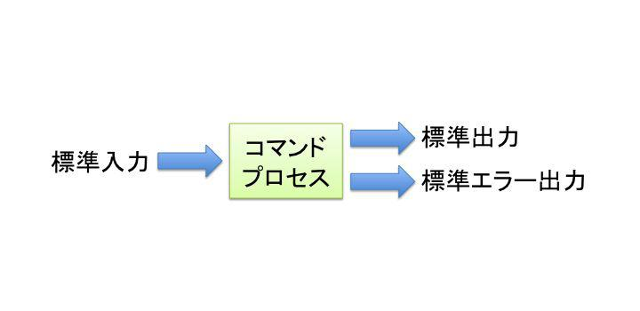
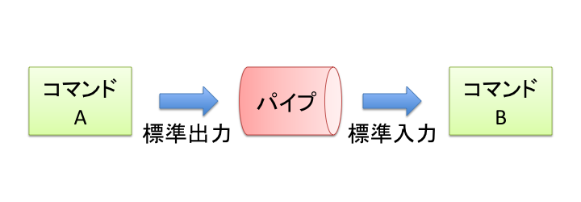

# 標準入出力とフィルタコマンド
Linuxのコマンドの多くは、「処理を行うデータの入力」と「処理を行った結果の出力」を持っています。これを標準入出力と呼んでいます。いくつかのコマンドの標準入出力を組み合わせてデータを処理することで、必要な結果を得ることができます。このような処理が行えるコマンドはフィルタコマンドと呼ばれています。

この章では、標準入出力とフィルタコマンドの使い方について学びます。

本章の内容

- 標準入出力
- リダイレクト
- 標準エラー出力
- パイプ
- データの先頭や末尾の表示(headコマンド・tailコマンド)
- テキストファイルのソート(sortコマンド)
- 行の重複の消去(uniq)
- 文字をカウントする（wc）
- 文字列を検索する（grepコマンド）

## 標準入出力
Linuxの多くのコマンドは、「1つの入力」と「2つの出力」があります。それぞれ標準入力・標準出力・標準エラー出力と呼びます。

- 標準入力
標準入力はコマンドに入ってくるデータのことです。標準入力のデフォルトはキーボードになっています。

- 標準出力
標準出力はコマンドの実行結果を書き出す先のことです。標準出力のデフォルトはコンソールになっています。

- 標準エラー出力
標準エラー出力はエラーメッセージを書き出す先のことです。標準エラー出力のデフォルトはコンソールになっています。

たとえばlsコマンドを実行した場合、カレントディレクトリのファイルとディクトリの一覧がコンソールに表示されます。

{width=50%}

## リダイレクト
標準出力は通常コンソールに表示されますが、リダイレクトを使うと標準出力をファイルに書き込めます。

### 標準出力のリダイレクト {.unlisted}
コマンドの実行結果として標準出力に出力される内容をファイルにリダイレクトします。リダイレクトは「>」を使って表します。

```
書式
コマンド > 出力先ファイル
```

lsコマンドの結果をリダイレクトしてファイルに書き込んでみます。作業用にworkディレクトリを作成して、作業を行います。

```
$ cd
$ mkdir work
$ cd work
$ touch test
```

リダイレクトを行わずにlsコマンドを実行してみます。

```
$ ls
test
```

結果はコンソールに表示されます。

標準出力をls-outputファイルにリダイレクトしてみます。

```
$ ls > ls-output
$ ls
ls-output  test
$ cat ls-output
ls-output
test
```

標準出力がファイルにリダイレクトされたので、コンソールには何も表示されず、作成されたファイル内にlsコマンドの実行結果が書き込まれていました。ls-outputが先に作成されてからlsコマンドが実行されるため、ls-output自身もlsコマンドの結果に含まれています。

### 標準出力の追加リダイレクト {.unlisted}
すでにリダイレクト先のファイルが存在している場合、リダイレクト結果は上書きされます。上書きせず、以前の結果を残したまま追記したい場合は、アペンド(>>)の記号を用います。

```
書式
コマンド >> 出力先ファイル
```

まず、通常のリダイレクトでlsコマンドを実行してみます。

```
$ ls > ls-output
$ cat ls-output
ls-output
test
```

前回書き込んだ結果は上書きされ、コマンド実行1回分の結果のみが書き込まれています。

次に「>>」でリダイレクトを行ってみます。

```
$ ls >> ls-output
$ cat ls-output
ls-output
test
ls-output
test
```

2回目のリダイレクトは追加リダイレクトのため、1回目の結果を残したまま2回目の実行結果を追記しています。

### catコマンドによるファイル作成 {.unlisted}
catコマンドは引数を指定しないと、標準入力で受け取ったデータをそのまま標準出力に出力します。デフォルトの標準入力はキーボードからの入力です。catコマンドの標準出力をファイルにリダイレクトすることで、キーボードから入力した文字列をファイルに書き込めます。

```
$ cat > cat-output
Hello!
This is cat redirect.
（行頭でCtrl+dを押す）
$ cat cat-output
Hello!
This is cat redirect.
```

「Ctrl+d」はEOF(End Of File)を入力するキーで、データ入力の終わりを意味します。catコマンドの標準入力はEOFを受け取ったことで入力が終わったと判断し、catコマンドの実行を終了します。

## 標準エラー出力
コマンドを実行してエラーが発生すると、エラーメッセージはコンソールに出力されます。エラーの出力は、標準出力ではなく、標準エラー出力へと出力されています。どちらの出力もデフォルトの出力先がコンソールになっているため区別が付きませんが、リダイレクトすることで別々に扱えます。

標準出力には番号がついており、標準出力が1、標準エラー出力が2になっています。標準エラー出力をリダイレクトするには「2>」と指定します。

```
書式
コマンド 2> 出力先ファイル
```

まず、エラーを発生させてみます。

```
$ ls nodir
ls: 'nodir' にアクセスできません: そのようなファイルやディレクトリはありません
```

存在しないディレクトリに対してlsコマンドを実行するとエラーが発生して、エラーメッセージが表示されます。このエラーメッセージをファイルにリダイレクトします。

```
$ ls nodir 2> ls-error
$ cat ls-error
ls: 'nodir' にアクセスできません: そのようなファイルやディレクトリはありません
```

コマンド実行時のメッセージはリダイレクトされたのでコンソールには表示されず、ファイルに書き込まれているのがわかります。

### 標準出力と標準エラー出力を別々にリダイレクトする {.unlisted}
リダイレクトすることで、標準出力と標準エラー出力は別々に扱われます。それぞれを別々のファイルにリダイレクトすることもできます。

```
書式
コマンド > 標準出力先ファイル 2> 標準エラー出力先ファイル
```

以下の例では、/etcディレクトリ内をls -Rコマンドで表示しています。いくつかの下位ディレクトリは参照できずエラーになります。正常な実行結果は ls-etcファイル、エラーメッセージはls-etc-errorファイルにリダイレクトされます。

```
$ ls -R /etc > ls-etc 2> ls-etc-error
$ cat ls-etc
/etc:
DIR_COLORS
（略）
almalinux-saphana.repo
$ cat ls-etc-error
ls: ディレクトリ '/etc/audit' を開くことが出来ません: 許可がありません
（略）
ls: ディレクトリ '/etc/sudoers.d' を開くことが出来ません: 許可がありません
```

ls-etcには正常に実行された結果、ls-etc-errorにはエラーメッセージがリダイレクトされています。

### 標準出力と標準エラー出力をまとめてリダイレクトする {.unlisted}
標準出力と標準エラー出力をまとめてリダイレクトして1つのファイルに書き込みたい場合には「2>&1」と指定します。標準エラー出力（2>）を標準出力(1)に混ぜる（&）というような意味合いになります。

```
書式
コマンド > 標準出力先ファイル 2>&1
```

前に実行したコマンドの結果を1つのls-etc-mixファイルにリダイレクトします。

```
$ ls -R /etc > ls-etc-mix 2>&1
$ less ls-etc-mix
```

ls-etc-mixには、正常に実行された結果とエラーメッセージがまとめてリダイレクトされています。エラーが発生する都度リダイレクトされているので、エラーメッセージはいろいろなところに書き込まれていることを確認してください。確認が終了したら「q」を入力してlessコマンドを終了します。

### 標準入力にリダイレクトする {.unlisted}
リダイレクトは標準入力に対しても行えます。

```
書式
コマンド < ファイル
```

たとえば、以下の例ではls-etc-mixファイルをlessコマンドの標準入力にリダイレクトしています。

```
$ less < ls-etc-mix
```

ただし、ほとんどのコマンドが引数にファイルを指定して読み込めるので、標準入力のリダイレクトを使うことは希です。

## パイプ
パイプを使うと、標準出力をその他のコマンドの標準入力に渡すことができます。パイプを使うことで、複数のコマンドを組み合わせて処理が行えます。パイプからのデータを受け取って処理するコマンドを「フィルタ」と呼びます。

```
書式
コマンド1 | コマンド2
```

パイプは「|」で指定します。一般的な日本語キーボードではShiftキーを押しながら円マークキー（BackSpaceキーの左）を入力します。

書式では、コマンド1の標準出力をコマンド2の標準入力に渡しています。このようなパイプによるデータの流れをテキストストリームとも呼びます。

{width=50%}

### lessコマンドによるページング {.unlisted}
lessコマンドは標準入力のデータをページ表示できます。コマンド実行時の結果表示が長すぎる場合などに使います。

```
$ cat /etc/services | less
# /etc/services:
# $Id: services,v 1.49 2017/08/18 12:43:23 ovasik Exp $
#
# Network services, Internet style
# IANA services version: last updated 2016-07-08
（略）
```

コマンドを実行している端末ソフトウェアがバックスクロールをサポートしているような場合には遡って見ることもできますが、遡れる行数が限られている場合には有効な方法です。

標準出力と標準エラー出力を1つのファイルに出力する場合の方法も利用できます。「2>&1」を指定しないで実行すると、エラーメッセージがまとめて表示されますが、スクロールすると消えてしまいます。

以下の2つのコマンドを実行して、結果を比較してみてください。

```
$ ls -R /etc | less
$ ls -R /etc 2>&1 | less
```


## データの先頭や末尾の表示(headコマンド・tailコマンド)
headコマンドやtailコマンドを実行すると、データの先頭や末尾など一部分のみを表示できます。

### headコマンドによる先頭の表示 {.unlisted}
headコマンドはデータの先頭を表示します。オプションを指定しない場合は、先頭から10行を標準出力します。

```
書式
head [オプション] [ファイル]

オプション
-n 行
先頭から指定した行を標準出力します。-行数と指定することもできます。
```

以下の例では、cat -nコマンドの標準出力をパイプで受け取って先頭5行を表示しています。

```
$ cat -n /etc/services | head -n 5
     1	# /etc/services:
     2	# $Id: services,v 1.49 2017/08/18 12:43:23 ovasik Exp $
     3	#
     4	# Network services, Internet style
     5	# IANA services version: last updated 2016-07-08
```

### tailコマンドによる末尾の表示 {.unlisted}
tailコマンドはデータの終わり部分を標準出力します。オプションを指定しない場合は、末尾から10行を標準出力します。

```
書式
tail [オプション] [ファイル]

オプション
-n 行
末尾から指定した行を標準出力します。-行数と指定することもできます。
```

以下の例では、cat -nコマンドの標準出力をパイプで受け取って末尾5行を表示しています。-行数というオプションの指定方法を使っています。

```
$ cat -n /etc/services | tail -5
 11469	axio-disc       35100/udp               # Axiomatic discovery protocol
 11470	pmwebapi        44323/tcp               # Performance Co-Pilot client HTTP API
 11471	cloudcheck-ping 45514/udp               # ASSIA CloudCheck WiFi Management keepalive
 11472	cloudcheck      45514/tcp               # ASSIA CloudCheck WiFi Management System
 11473	spremotetablet  46998/tcp               # Capture handwritten signatures
```

## テキストファイルのソート(sortコマンド)
sortコマンドはデータをソートします。オプションでどのような順序でソートするか指定することができます。

```
書式
sort [オプション] [ファイル]

オプション
-k n
n列目のデータをソートします。

-t 文字列
列の区切りとして文字列を使用します。デフォルトは空白文字が使用されます。

-n
数値としてソートします。

-r
逆順でソートします。
```

各オプションの動作を確認してみましょう。

### ソート用データの確認 {.unlisted}
Linuxのユーザー情報が記述されているファイルである/etc/passwdをデータとして使用して、sortコマンドの動作を確認してみます。

tailコマンドで末尾5行だけ表示してみます。

```
$ tail -5 /etc/passwd
sshd:x:74:74:Privilege-separated SSH:/usr/share/empty.sshd:/usr/sbin/nologin
chrony:x:982:981:chrony system user:/var/lib/chrony:/sbin/nologin
dnsmasq:x:981:980:Dnsmasq DHCP and DNS server:/var/lib/dnsmasq:/usr/sbin/nologin
tcpdump:x:72:72::/:/sbin/nologin
linuc:x:1000:1000:LinuC:/home/linuc:/bin/bash
```

先頭がユーザー名、3番目がユーザーID番号です。これらのデータを使ってどのようにソートが変わるのか確認します。

### 単純なソート {.unlisted}
ユーザー名でソートしてみます。

```
$ tail -5 /etc/passwd | sort
chrony:x:982:981:chrony system user:/var/lib/chrony:/sbin/nologin
dnsmasq:x:981:980:Dnsmasq DHCP and DNS server:/var/lib/dnsmasq:/usr/sbin/nologin
linuc:x:1000:1000:LinuC:/home/linuc:/bin/bash
sshd:x:74:74:Privilege-separated SSH:/usr/share/empty.sshd:/usr/sbin/nologin
tcpdump:x:72:72::/:/sbin/nologin
```

ユーザー名がアルファベット順でソートされました。

### 逆順のソート {.unlisted}
逆順でソートしてみます。

```
$ tail -5 /etc/passwd | sort -r
tcpdump:x:72:72::/:/sbin/nologin
sshd:x:74:74:Privilege-separated SSH:/usr/share/empty.sshd:/usr/sbin/nologin
linuc:x:1000:1000:LinuC:/home/linuc:/bin/bash
dnsmasq:x:981:980:Dnsmasq DHCP and DNS server:/var/lib/dnsmasq:/usr/sbin/nologin
chrony:x:982:981:chrony system user:/var/lib/chrony:/sbin/nologin
```

ユーザー名がアルファベット逆順でソートされました。

### 列を指定したソート {.unlisted}
3番目のユーザーID番号でソートしてみます。区切り文字を「:」に指定します。

```
$ tail -5 /etc/passwd | sort -k 3 -t :
linuc:x:1000:1000:LinuC:/home/linuc:/bin/bash
tcpdump:x:72:72::/:/sbin/nologin
sshd:x:74:74:Privilege-separated SSH:/usr/share/empty.sshd:/usr/sbin/nologin
dnsmasq:x:981:980:Dnsmasq DHCP and DNS server:/var/lib/dnsmasq:/usr/sbin/nologin
chrony:x:982:981:chrony system user:/var/lib/chrony:/sbin/nologin
```

ユーザーID番号でのソートになりましたが、数値ではなく文字列としてソートされてしまったので、1000が一番最初に来てしまいました。

### 数値としてのソート {.unlisted}
ユーザーID番号を数値としてソートするよう-nオプションを追加します。

```
$ tail -5 /etc/passwd | sort -k 3 -t : -n
tcpdump:x:72:72::/:/sbin/nologin
sshd:x:74:74:Privilege-separated SSH:/usr/share/empty.sshd:/usr/sbin/nologin
dnsmasq:x:981:980:Dnsmasq DHCP and DNS server:/var/lib/dnsmasq:/usr/sbin/nologin
chrony:x:982:981:chrony system user:/var/lib/chrony:/sbin/nologin
linuc:x:1000:1000:LinuC:/home/linuc:/bin/bash
```

ユーザーID番号を数値の小さい順番にソートしました。

## 行の重複の消去(uniq)
uniqコマンドを使うことで直前の行と同じ内容があった場合、対象行を出力しません。連続している同じ内容の行を、1行にまとめることができます。

```
書式
uniq [ファイル]
```

### 重複の消去用データの作成 {.unlisted}
以下のような内容のファイルを作成します。

```
$ cat > uniq-test
A
B
A
C
C
D
（行頭でCtrl+dを入力）
```
```
$ cat uniq-test
A
B
A
C
C
D
```

### 重複を消去する {.unlisted}
uniqコマンドを実行します。

```
$ cat uniq-test | uniq
A
B
A
C
D
```

前後の重複していた文字列Cが1行にまとめられましたが、Aは間にBが入っているので重複とは見なされず残ったままです。

uniqコマンドに渡す前に、sortコマンドでソートしてみます。

```
$ cat uniq-test | sort | uniq
A
B
C
D
```

今度はAも重複が消去されました。

## 文字をカウントする（wc）
wcコマンドは、データの文字をカウントします。

```
書式
wc [オプション] [ファイル]

オプション
-c 文字数をカウントする

-l
行をカウントする

-w
単語をカウントする
```

各オプションの動作を確認してみましょう。

### 文字をカウントする {.unlisted}
wcコマンドで、文字をカウントします。オプションを指定しないと、行数、単語数、文字数がまとめて表示されます。

```
$ cat /etc/services | wc
  11473   63129  692252
```

オプションを指定することで、指定した種類でのカウントのみを行えます。

```
$ cat /etc/services | wc -l
11473
```
```
$ cat /etc/services | wc -w
63129
```
```
$ cat /etc/services | wc -c
692252
```

## 文字列を検索する（grepコマンド）
grepコマンドは、指定された条件でデータ内の文字列を検索します。

```
書式
grep [オプション] 検索条件 [ファイル]
```

検索条件はただの文字列のほか、正規表現で指定します。

### 正規表現 {.unlisted}
grepコマンドでは、検索条件として正規表現が用いられます。正規表現は多くのプログラミング言語でも利用されているパターンの表現方法です。

正規表現で使われる記号と意味

| 記号 | 意味
|-|-
| ^ | 行頭を表す
| $ | 行末を表す
| . | 任意の一字を意味する
| * | 直前文字の0回以上の繰り返しを意味する
| [...] | ...の中の任意の一字を意味する
| [^...] | ...の文字が含まれないことを意味する
| \\ | 正規表現の記号をエスケープする

正規表現の利用例

|記号 | 意味
|-|-
| ^a | aで始まっている行
| b$ | bで終わっている行
| a.b | aとbの間に1文字入っている
| [ab]ab | aもしくはbに続くab(aab,bab)
| [^ab]ab | aもしくはbで始まらない(not)で、abが続くもの(例: xab, zab等)

### 単純な文字列検索 {.unlisted}
grepコマンドの検索条件指定に正規表現を使わなければ、単純な文字列検索が行えます。

```
$ cat /etc/services | grep http
#       http://www.iana.org/assignments/port-numbers
http            80/tcp          www www-http    # WorldWideWeb HTTP
http            80/udp          www www-http    # HyperText Transfer Protocol
http            80/sctp                         # HyperText Transfer Protocol
https           443/tcp                         # http protocol over TLS/SSL
https           443/udp                         # http protocol over TLS/SSL
https           443/sctp                        # http protocol over TLS/SSL
gss-http        488/tcp
gss-http        488/udp
（略）
```

httpという文字列が含まれている行を検索できました。

### 先頭文字列を指定した検索 {.unlisted}
先頭の文字列を表す「^」を指定して検索を行います。

```
cat /etc/services | grep ^http
http            80/tcp          www www-http    # WorldWideWeb HTTP
http            80/udp          www www-http    # HyperText Transfer Protocol
http            80/sctp                         # HyperText Transfer Protocol
https           443/tcp                         # http protocol over TLS/SSL
https           443/udp                         # http protocol over TLS/SSL
https           443/sctp                        # http protocol over TLS/SSL
http-mgmt       280/tcp                 # http-mgmt
http-mgmt       280/udp                 # http-mgmt
（略）
```

httpから始まる行だけに絞り込まれました。

### 行末文字列を指定した検索 {.unlisted}
行末の文字列を表す「$」を指定して検索を行います。

```
$ cat /etc/services | grep http$
md-cg-http      2688/tcp                # md-cf-http
md-cg-http      2688/udp                # md-cf-http
webemshttp      2851/tcp                # webemshttp
webemshttp      2851/udp                # webemshttp
plysrv-http     6770/tcp                # PolyServe http
plysrv-http     6770/udp                # PolyServe http
manyone-http    8910/tcp                # manyone-http
manyone-http    8910/udp                # manyone-http
```

httpで終わる行だけに絞り込まれました。

\pagebreak

