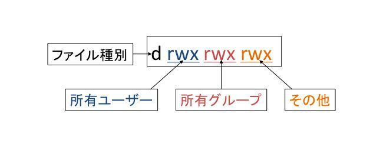
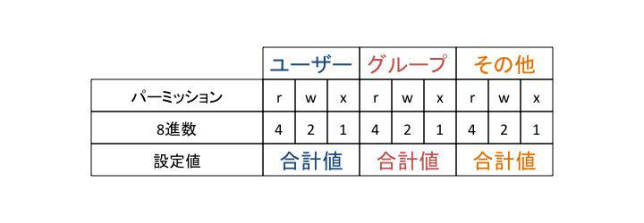

# ファイルやディレクトリのアクセス制御
アクセス制御とは、ファイルやディレクトリに対してアクセスを許可したり許可しないようにする仕組みです。LinuxはマルチユーザーのOSなので、セキュリティ保護などの観点からファイルに対するアクセス制御が必要です。アクセス制御は、ファイルに対する所有者や所有グループを設定し、それぞれに対するアクセス権を設定することで実現しています。

本章では、ファイルのアクセス制御を行うためのユーザー権限とアクセス権について解説します。

本章の内容

- ファイルの所有者と所有グループ
- ファイルとアクセス権


## ファイルの所有者と所有グループ
ファイルやディレクトリには、所有者（ユーザー）と所有グループが設定されます。この所有権に基づいてアクセス制御が行われます。

ファイルを作成すると、ファイルの所有者は作成したユーザーに、所有グループは作成したユーザーのプライマリーグループに設定されます。

### 所有者と所有グループの確認
所有者、所有グループは、lsコマンドに-lオプションをつけて実行すれば確認できます。

touchコマンドでtestファイルを作成し、所有者と所有グループを確認します。

```
$ touch test
$ ls -l test
-rw-r--r--. 1 linuc linuc 0  8月 16 10:44 test
```

一番左の「-rw-r--r--.」がアクセス権です。3番目の項目が所有者（ユーザーlinuc）、4番目の項目が所有グループ（linucグループ）です。

### 所有者の変更
ファイルの所有者を変更するにはchownコマンドを使います。指定方法によって所有グループも変更できます。

```
書式
chown [オプション] [ユーザー][:[グループ]] ファイル

オプション
-R
引数で指定したディレクトリ内のファイルやディレクトリの所有者を再帰的に変更。
```

ユーザーとグループを変更するには、root権限が必要です。

新しい所有者は、以下のパターンで指定できます。

所有者を変更する
```
chown ユーザー ファイル
```

所有者と所有グループを変更する
```
chown ユーザー:グループ ファイル
```

所有グループを変更する
```
chown :グループ ファイル
```

以下の実行例では、作成したtestファイルの所有者を変更します。一般ユーザーでは所有者は変更できないので、sudoコマンドを使ってroot権限でchownコマンドを実行します。

```
$ chown sato test
chown: 'test' の所有者を変更中: 許可されていない操作です
$ sudo chown sato test
$ ls -l test
-rw-r--r--. 1 sato linuc 0  8月 16 10:44 test
$ rm test
rm: 書き込み保護されたファイル 通常の空ファイル 'test' を削除しますか?y
```

testファイルの所有者をユーザーsatoに変更できました。最後にファイルを削除しようとすると、所有者が異なるファイルを削除しようとしているため、確認が必要となります。

### 所有グループの変更
ファイルの所有グループを変更するにはchgrpコマンドを使います。

```
書式
chgrp グループ ファイル

オプション
-R
引数で指定したディレクトリ内のファイルやディレクトリの所有グループを再帰的に変更。
```

一般ユーザーは、自分が所属しているグループを所有グループとして指定できます。sudoコマンドを使ってroot権限でchgrpコマンドを実行することで、すべてのグループを所有グループとして指定できます。

以下の実行例では、ディレクトリを作成し、一般ユーザーとして所有グループを変更しています。

```
$ id
uid=1000(linuc) gid=1000(linuc) groups=1000(linuc),10(wheel) context=unconfined_u:unconfined_r:unconfined_t:s0-s0:c0.c1023
$ mkdir testdir
$ chgrp wheel testdir
$ ls -ld testdir
drwxr-xr-x. 2 linuc wheel 6  8月 16 10:57 testdir
$ chgrp kvm testdir
chgrp: 'testdir' のグループを変更中: 許可されていない操作です
```

サブグループとして所属しているwheelグループを所有グループに変更できましたが、所属していないkvmグループには変更できませんでした。

\pagebreak

## ファイルとアクセス権
ファイルのアクセス権には「読み込み（Read）」「書き込み（Write）」「実行（eXecute）」の3つの種類があります。このアクセス権を、所有者、所有グループ、その他のユーザーの3つに対してそれぞれ設定できます。

ファイルへのアクセス権のことを「パーミッション」や「モード」とも呼びます。

ファイルのアクセス権を変更するにはchmodコマンドを使います。

### アクセス権を確認する
ファイルのモードは、lsコマンドに-lオプションをつけて実行すれば確認できます。
一番左がファイルのモードを示しています。

{width=50%}

r,w,xの意味

| 項目 | 8進数 | 内容	
| - | - | -
| r | 4 | 読み込み
| w | 2 | 書き込み
| x | 1 | 実行、またはディレクトリ内に入れる

rwxは、所有者と所有グループ、その他のユーザーの3つに対して指定できます。
rが設定されているとファイルやディレクトリの読み込みが可能、wが設定されているとファイルやディレクトリへの書き込みが可能です。xが設定されているとファイルをプログラムとして実行できるか、ディレクトリであればディレクトリに入れます。

### アクセス権の変更
ファイルのアクセス権を変更するにはchmodコマンドを使います。

```
書式
chmod モード[,モード]... ファイル
chmod 8進数表記のモード ファイル

オプション
-R
引数で指定したディレクトリ内のファイルやディレクトリのアクセス権を再帰的に変更。
```

モードの指定は2通りの記述方法があります。

- ユーザー種別毎のモード書式をカンマで区切って指定
- 8進数3桁でまとめて指定

### モード書式によるアクセス権の設定
モードは「u」(所有ユーザー)、「g」(所有グループ)、「o」(その他のユーザー)に対して、「r」(読み)、「w」(書き)、「x」(実行またはディレクトリの変更)を「設定(=)」、「追加(+)」、「取り消し(-)」します。u、g、oの全てに同じ権限を指定するときはaを指定します。

以下の実行例では、testファイルにグループの書き込み権限を追加しています。

```
$ touch test
$ ls -l test
-rw-r--r--. 1 linuc linuc 0  8月 16 14:24 test
$ chmod g+w test
$ ls -l test
-rw-rw-r--. 1 linuc linuc 0  8月 16 14:24 test
```

以下の実行例では、testdirディレクトリにグループとその他のユーザーの書き込み権限を追加しています。

```
$ ls -ld testdir
drwxr-xr-x. 2 linuc wheel 6  8月 16 14:25 testdir
$ chmod g+w,o+w testdir
$ ls -ld testdir
drwxrwxrwx. 2 linuc wheel 6  8月 16 14:25 testdir
```

### 8進数によるアクセス権の設定
8進数によるアクセス権の設定は、設定したいアクセス権を8進数の合計値に置き換え、3桁で指定します。

{width=70%}

たとえば、「-rw-r--r--」と指定する場合、rは4、wは2なので「420 400 400」の合計で「644」となります。「rwxr-xr-x」と指定する場合、xは1なので「421 401 401」の合計で「755」となります。

以下の実行例では、ファイルのアクセス権を指定しています。

```
$ ls -l test
-rw-rw-r--. 1 linuc linuc 0  8月 16 14:24 test
$ chmod 644 test
$ ls -l test
-rw-r--r--. 1 linuc linuc 0  8月 16 14:24 test
```

「644」と指定したので、アクセス権は「-rw-r--r--」となりました。

以下の実行例では、ディレクトリのアクセス権を指定しています。

```
$ ls -ld testdir
drwxrwxrwx. 2 linuc wheel 6  8月 16 14:25 testdir
$ chmod 755 testdir/
$ ls -ld testdir
drwxr-xr-x. 2 linuc wheel 6  8月 16 14:25 testdir
```

「755」と指定したので、「rwxr-xr-x」となりました。

### アクセス権変更によるアクセス制御の確認
アクセス権を変更して、アクセス制御が行われるところを確認します。

以下の実行例では、まずファイルに書き込み可能な状態でcatコマンドを使って文字列を書き込みます。

```
$ ls -l test
-rw-rw-r--. 1 linuc linuc 0  8月 16 14:24 test
$ cat > test
Write Test.
（行頭でCtrl+dを押す）
```
```
$ cat test
Write Test.
```

書き込みできていることが確認できます。

次に、書き込めていたファイルの所有者に対する書き込みのアクセス権を無くして、書き込みができなくなることを確認します。

```
$ chmod u-w test
$ ls -l test
-r--rw-r--. 1 linuc linuc 12  8月 16 18:10 test
$ cat > test
-bash: test: 許可がありません
```

書き込み権限がなくなったので、書き込みができなくなりました。

以下の実行例では、ディレクトリのアクセス権を確認してみます。書き込み可能なディレクトリ内にtouchコマンドでtestファイルを作成します。

```
$ ls -ld testdir
drwxr-xr-x. 2 linuc wheel 6  8月 16 14:25 testdir
$ touch testdir/test
$ ls -l testdir
合計 0
-rw-r--r--. 1 linuc linuc 0  8月 16 18:21 test
```

次に、ディレクトリに対する書き込みのアクセス権を無くすと、ファイルが作成できなくなることを確認します。

```
$ chmod 555 testdir
$ ls -ld testdir
dr-xr-xr-x. 2 linuc wheel 18  8月 16 18:21 testdir
$ touch testdir/test2
touch: 'testdir/test2' に touch できません: 許可がありません
```

書き込み権限がなくなったので、ファイルが作成できなくなりました。

\pagebreak

